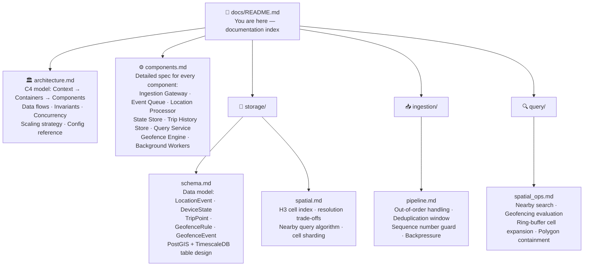
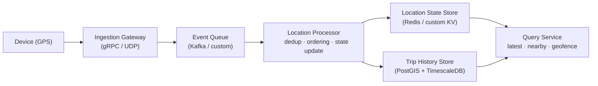
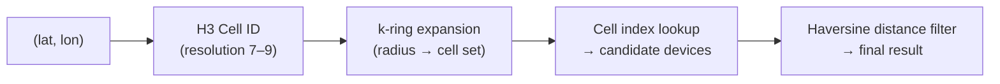

# SignalRoute — Documentation

> **Version:** 0.2 (Fallback Runtime) · **Last Updated:** 2026-04-26

Welcome to the SignalRoute documentation. SignalRoute is a backend-only geospatial system written in C++ for real-time GPS/location tracking at scale. It ingests high-frequency location updates from many devices, serves low-latency reads (latest location, nearby search), evaluates geofences in real time, and retains full trip history for replay and analytics.

---

## Quick Navigation

---

## Document Map

### Core Architecture

| Document | What to read it for |
|----------|---------------------|
| [architecture.md](./architecture.md) | **Start here.** Full system overview using the C4 model. Understand service boundaries, all data flows, core invariants, concurrency model, scaling strategy, and configuration. |
| [components.md](./components.md) | Deep-dive into each individual component. Read this when implementing or debugging a specific subsystem. |
| [plans/dependency_strategy.md](./plans/dependency_strategy.md) | Build switches and dependency integration order for protobuf/gRPC, Kafka, Redis, PostGIS, H3, Prometheus, and toml++. |

### Storage

| Document | What to read it for |
|----------|---------------------|
| [storage/schema.md](./storage/schema.md) | Physical data model for all tables. Read when implementing the write path, query service, or trip analytics. |
| [storage/spatial.md](./storage/spatial.md) | H3 indexing design, resolution selection, cell-based sharding, and how nearby queries are served. |

### Ingestion

| Document | What to read it for |
|----------|---------------------|
| [ingestion/pipeline.md](./ingestion/pipeline.md) | Full ingestion pipeline: dedup, out-of-order event handling, sequence number guard, backpressure control. Read when implementing the Location Processor or reasoning about data correctness. |

### Query

| Document | What to read it for |
|----------|---------------------|
| [query/spatial_ops.md](./query/spatial_ops.md) | How nearby search, geofence evaluation, and spatial filtering are executed efficiently. Read when implementing the Query Service or Geofence Engine. |

---

## Key Concepts at a Glance

### Current Implementation Baseline

The repository currently contains a dependency-free fallback runtime that proves the core framework and feature behavior without external infrastructure:

| Area | Current status |
|------|----------------|
| Runtime model | Single C++ binary with service roles for gateway, processor, query, geofence, matcher/matching, and standalone composition |
| In-process events | Typed `EventBus` payloads and observer-style composition are implemented for processor, state/history fan-out, geofence evaluation, metrics, gateway, matching, and workers |
| Storage adapters | Redis and PostGIS clients expose deterministic in-memory fallback behavior for unit and lifecycle tests |
| Transport adapter | Kafka producer/consumer expose deterministic in-memory fallback behavior; production Kafka is still pending |
| Payload format | Gateway and processor use CSV in default fallback builds; with `SR_ENABLE_PROTOBUF=ON`, gateway emits versioned protobuf location payloads and processor decodes protobuf with CSV fallback retained |
| Protobuf boundary | Domain-to-wire and generated protobuf adapters exist under `src/common/proto/`; gRPC stubs remain gated behind `SR_ENABLE_GRPC=ON` |
| Spatial adapter | H3 interface exists with deterministic fallback cells; production H3 integration is still pending |
| Services | Gateway, processor, query, geofence, and matching lifecycle paths are wired enough for fallback tests |
| Workers | H3 cleanup, DLQ replay, and metrics reporter have deterministic `run_once` flows and event publication |

The docs below describe the target architecture, but when they mention Kafka, Redis, PostGIS, gRPC, protobuf, Prometheus, or real H3, treat that as the production adapter target unless a section explicitly says fallback runtime.

### Data Model

SignalRoute processes **location events**. Each event carries:
- A **device_id** — unique identifier for a tracked entity (vehicle, phone, asset)
- A **GPS coordinate** — `(latitude, longitude)` with optional altitude and accuracy
- A **timestamp** — milliseconds since Unix epoch (device clock, not server clock)
- A **sequence number** — monotonically increasing per device, used for ordering and dedup
- Optional **telemetry** — speed, heading, battery level, custom metadata

Two persistence targets:

| Store | What it holds | Access pattern |
|-------|---------------|----------------|
| **Location State Store** | One record per device — the latest confirmed position | Point lookup by `device_id`, O(1) |
| **Trip History Store** | Full time-series of all accepted events per device | Range scan by `(device_id, time_range)` |

### System Pipeline

### Spatial Indexing

Nearby queries and geofence pre-filtering use **H3** — Uber's hexagonal hierarchical spatial index.

- Each device's H3 cell is stored alongside its latest location
- Nearby queries expand to a set of H3 cells covering the search radius, then refine with exact distance
- Geofences pre-filter candidate devices by cell overlap before polygon containment test

---

## Completion Roadmap

Implementation is tracked by feature and subsystem, not by test phases. See [plans/finish_plan.md](./plans/finish_plan.md) for the detailed remaining work.

| Area | Done in fallback runtime | Remaining production work |
|------|--------------------------|---------------------------|
| Core framework | Domain types, config defaults, typed events, service lifecycle, metrics counters | Stronger config validation and structured errors |
| Ingestion and processing | Gateway fallback ingest, Kafka fallback, dedup, sequence guard, state/history writes, event-driven fan-out | gRPC/UDP servers, protobuf payloads, real Kafka integration |
| Query | Latest, nearby, trip, downsampling, and spatial trip handlers over fallback stores | gRPC/HTTP API layer and real Redis/PostGIS adapters |
| Geofence | Registry, enter/exit, old-cell exit checks, dwell checker, audit fallback, event publication | Real H3/PostGIS loading, Kafka geofence serialization, admin CRUD |
| Matching | Strategy registry, nearest strategy, reservation manager, service lifecycle, request handling | Kafka/protobuf request/result loop and production reservation adapter |
| Workers and ops | H3 cleanup, DLQ replay, metrics reporter fallback flows | Prometheus endpoint, health/admin service, CI, packaging, load tests |

---

## Design Decisions (Summary)

| # | Decision | Choice | Why |
|---|----------|--------|-----|
| D1 | Ingest protocol | gRPC (primary) + UDP (low-latency mode) | gRPC for reliability and schema; UDP for minimal overhead on constrained devices |
| D2 | Event ordering | Sequence number guard per device | Server-side last-write-wins with monotone seq; rejects stale events without global coordination |
| D3 | State store | Redis with `SETNX`-style CAS | Sub-millisecond reads; atomic compare-and-set for seq guard |
| D4 | History store | TimescaleDB (Postgres + hypertables) + PostGIS | Time-partitioned inserts; native spatial types; SQL for analytics |
| D5 | Spatial index | H3 at resolution 7 (default) | ~5 km² cells balance lookup precision vs. fan-out; configurable per use-case |
| D6 | Deduplication | Sliding window (5 min) keyed by `(device_id, seq)` | Handles retries and duplicate UDP packets; bounded memory |
| D7 | Queue | Kafka with per-device partitioning | Ordering guaranteed per device; horizontal scale; replayability |
| D8 | Geofence evaluation | Event-driven pull: Processor triggers eval on state change | Avoids polling; scales with event rate, not device count |
| D9 | Nearby query model | H3 k-ring → candidate set → haversine filter | Two-phase: fast index prune + exact distance; index fits in memory |
| D10 | Out-of-order handling | Event-time ordering with per-device sequence + server-side watermark | Rejects events older than watermark; accepts late events within tolerance window |

Full rationale: [architecture.md § Design Decision Log](./architecture.md#design-decision-log)

---

## Frequently Asked Questions

**Q: How does the system handle duplicate GPS events?**
Every device assigns a monotonically increasing sequence number to each event. The Location Processor maintains a deduplication window (default 5 min) keyed by `(device_id, seq)`. Duplicates are discarded before any state mutation. See [ingestion/pipeline.md](./ingestion/pipeline.md).

**Q: What happens when GPS events arrive out of order?**
The Location State Store only accepts an update if the incoming `seq` is strictly greater than the stored `last_seq` for that device. Stale events are counted, logged, and discarded. Trip history rows are inserted with their original event timestamp, so history is always correct even if written out of order. See [ingestion/pipeline.md](./ingestion/pipeline.md).

**Q: Why H3 instead of a traditional R-tree or quadtree?**
H3 cells are fixed-size hexagons with uniform neighbor distance, which makes k-ring expansion produce a consistent search radius regardless of location. R-trees require per-query traversal and are harder to shard. H3 cell IDs are compact integers — the entire cell index for millions of devices fits in Redis. See [storage/spatial.md](./storage/spatial.md).

**Q: How does geofencing scale?**
Geofence evaluation is event-driven — it runs only when a device's state changes. H3 pre-filtering eliminates devices not near any fence before the polygon containment test runs. Geofences are stored by their covering H3 cell set, so lookup is O(cells_in_fence) rather than O(total_devices). See [query/spatial_ops.md](./query/spatial_ops.md).

**Q: Why separate the Ingestion Gateway from the Location Processor?**
The gateway is stateless and horizontally scalable — it validates, authenticates, and enqueues. The processor owns per-device ordering, dedup, and state updates, which require per-device statefulness. Decoupling them via a queue allows the gateway to absorb traffic bursts without blocking on state mutations. See [architecture.md § C2](./architecture.md#c2--container-diagram).

**Q: Why TimescaleDB for trip history instead of a pure columnar store?**
Trip history queries combine time-range filters with spatial predicates (`ST_DWithin`, polygon containment). PostGIS + TimescaleDB gives native geospatial types, time-partitioning for efficient range scans, and full SQL for ad-hoc analytics — without requiring a separate spatial query layer. See [storage/schema.md](./storage/schema.md).
