# SignalRoute — Architecture (C4 Model)

> **Version:** 0.1 (Draft) · **Last Updated:** 2026-04-18 · **Status:** In Review

This document describes the architecture of **SignalRoute**, a backend-only geospatial system for real-time GPS/location tracking at scale. It follows the [C4 model](https://c4model.com/) (Context → Containers → Components) and covers service boundaries, data flows, core invariants, concurrency strategy, and scaling design.

---

## Table of Contents

1. [Goals & Non-Goals](#goals--non-goals)
2. [C1 — System Context](#c1--system-context)
3. [C2 — Container Diagram](#c2--container-diagram)
4. [C3 — Component Diagrams](#c3--component-diagrams)
5. [Data Flows](#data-flows)
6. [Core Invariants](#core-invariants)
7. [Spatial Indexing Strategy](#spatial-indexing-strategy)
8. [Concurrency & Threading Model](#concurrency--threading-model)
9. [Memory & Resource Budgets](#memory--resource-budgets)
10. [Fault Tolerance & Recovery](#fault-tolerance--recovery)
11. [Scaling Strategy](#scaling-strategy)
12. [Configuration Reference](#configuration-reference)
13. [Design Decision Log](#design-decision-log)
14. [Implementation Checklist](#implementation-checklist)
15. [Open Questions](#open-questions)
16. [Future Work](#future-work)

---

## Goals & Non-Goals

### Goals (v1)

| # | Goal |
|---|------|
| G1 | High-frequency location ingestion — sustain ≥ 100k events/sec per node |
| G2 | Low-latency latest-location reads — P99 < 5 ms |
| G3 | Efficient nearby search — return devices within radius R in < 20 ms |
| G4 | Correct event ordering — stale and duplicate events are discarded, not applied |
| G5 | Persistent trip history — full replay and time-range analytics |
| G6 | Real-time geofencing — enter/exit events delivered within one event cycle |
| G7 | Horizontal scalability — ingestion and query scale independently |
| G8 | Fault tolerance — no data loss on single-node failure |

### Non-Goals (v1)

| # | Non-Goal | Reason |
|---|----------|--------|
| NG1 | Web or mobile UI | Backend-only system |
| NG2 | Map matching / routing | Out of scope unless trip analysis requires it |
| NG3 | Sub-second geofence evaluation at 10M+ polygon complexity | v1 targets convex/circle fences; complex polygon support is Phase 3 |
| NG4 | Multi-tenant data isolation | Single namespace per deployment |
| NG5 | Global multi-region replication | Single-region HA only in v1 |
| NG6 | Device firmware or SDK | Server-side only |

---

## C1 — System Context

Who interacts with SignalRoute and what external systems does it depend on?

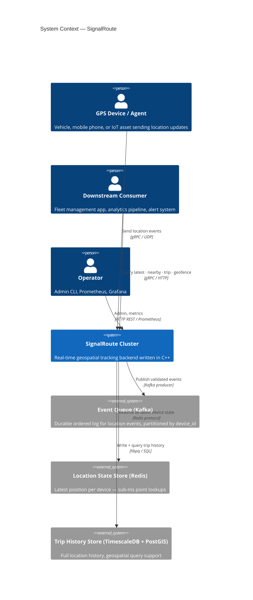

### External Interfaces

| Interface | Protocol | Direction | Description |
|-----------|----------|-----------|-------------|
| Device Ingest API | gRPC / UDP | Inbound | Location event batches from tracked devices |
| Consumer Query API | gRPC / HTTP/2 | Inbound | Latest location, nearby devices, trip replay, geofences |
| Admin API | HTTP REST | Inbound | Health, metrics, geofence management |
| Metrics Export | Prometheus text | Outbound | Internal observability metrics |
| Event Queue | Kafka binary | Bidirectional | Validated events published; processor consumes |
| State Store | Redis RESP | Outbound | Atomic latest-position read/write |
| History Store | PostgreSQL wire | Outbound | Append trip points, range queries |

---

## C2 — Container Diagram

A **container** is a deployable unit. All C++ services compile from one binary (`trackmesh --role=…`).

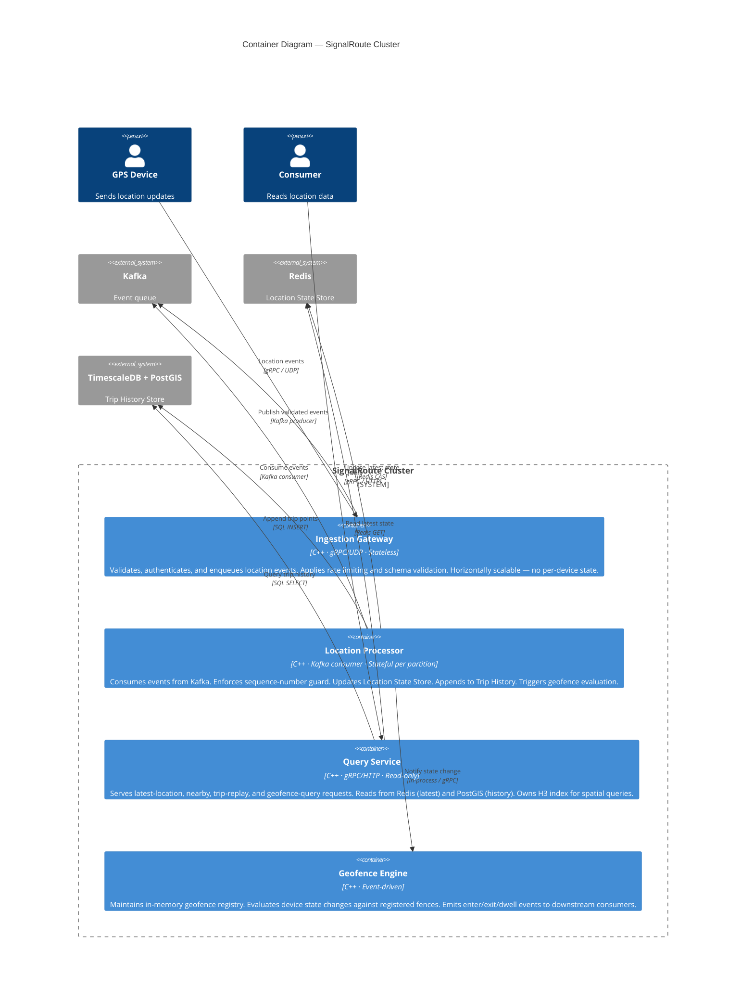

### Container Summary

| Container | Role | Instances | State |
|-----------|------|-----------|-------|
| **Ingestion Gateway** | Receive, validate, enqueue | 1–N (stateless, load balanced) | Stateless |
| **Location Processor** | Process, deduplicate, persist | 1 per Kafka partition group | Stateful (per-device dedup window) |
| **Query Service** | Serve all read queries | 1–N (stateless, read-only) | Stateless (reads from Redis + PostGIS) |
| **Geofence Engine** | Evaluate fences, emit events | 1–N (each holds full fence registry) | In-memory fence registry |

---

## C3 — Component Diagrams

### Ingestion Gateway

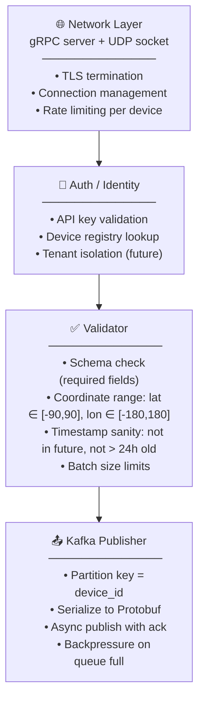

---

### Location Processor

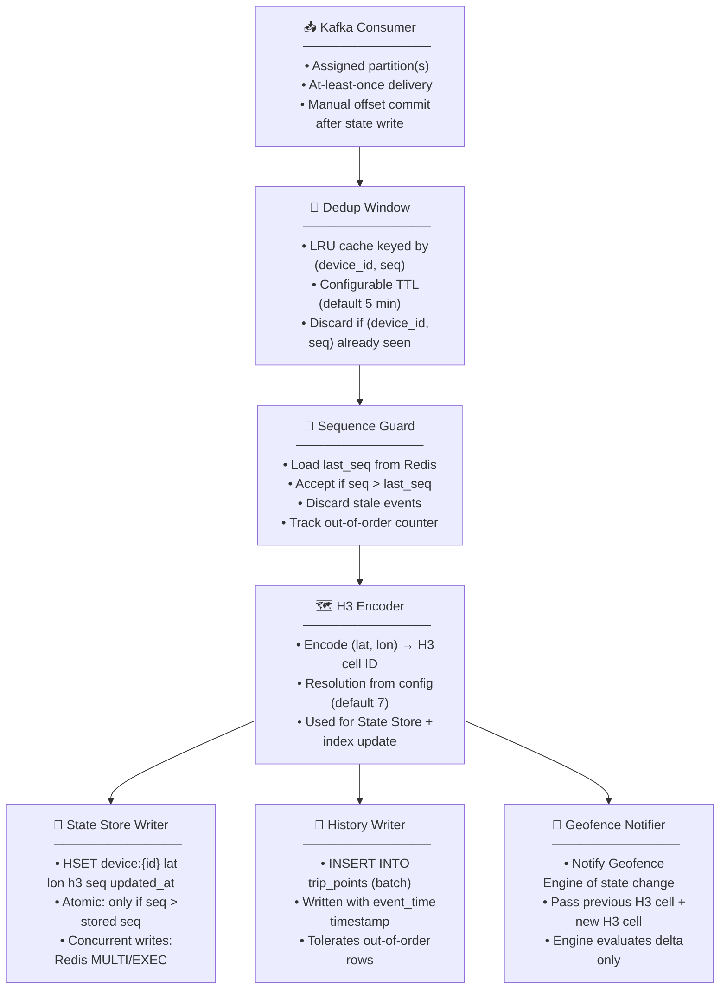

---

### Query Service

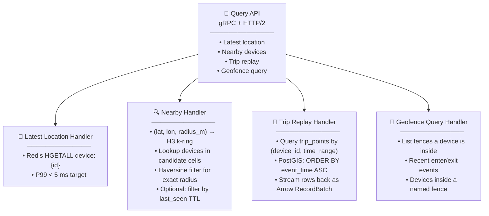

---

### Geofence Engine

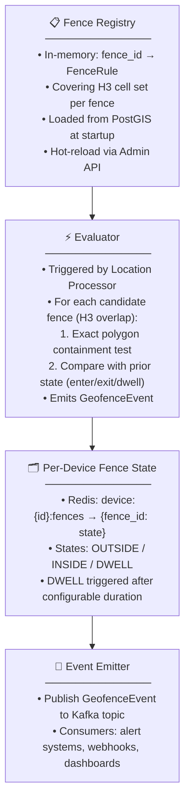

---

## Data Flows

### Ingestion Path

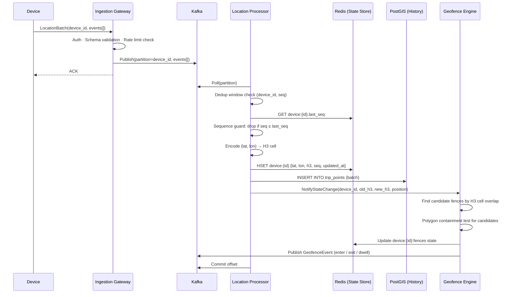

**Steps in detail:**

| Step | Description |
|------|-------------|
| 1. Auth + validate | Check API key; validate coordinate ranges, timestamp bounds, batch size |
| 2. Enqueue | Publish to Kafka, partition by `device_id` (preserves per-device ordering) |
| 3. ACK gateway | Gateway ACKs to device immediately after successful enqueue |
| 4. Dedup | Processor checks `(device_id, seq)` against LRU dedup cache |
| 5. Sequence guard | Load `last_seq` from Redis; discard if `seq ≤ last_seq` |
| 6. H3 encode | Compute H3 cell ID at configured resolution |
| 7. State update | Atomic Redis update with seq guard |
| 8. History append | Batch insert to `trip_points` hypertable |
| 9. Geofence eval | Triggered by H3 cell change or periodic tick; polygon containment test |
| 10. Offset commit | Commit Kafka offset only after all writes succeed |

---

### Latest Location Read Path

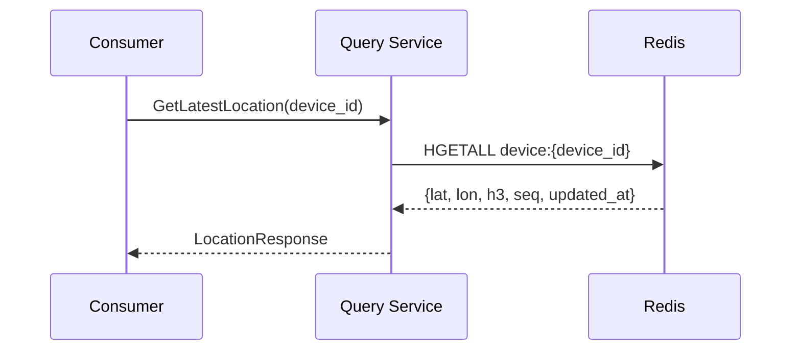

---

### Nearby Search Path

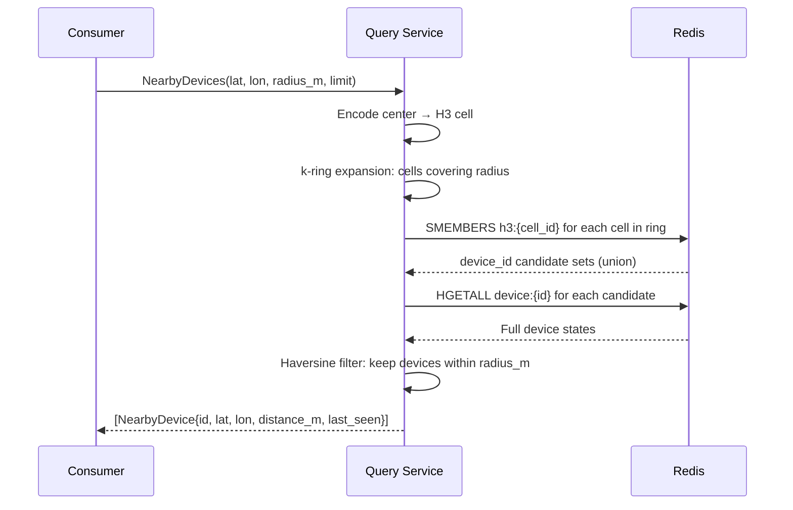

---

### Trip Replay Path

```mermaid
sequenceDiagram
    participant C  as Consumer
    participant QS as Query Service
    participant PG as PostGIS

    C->>QS: GetTrip(device_id, from_ts, to_ts)
    QS->>PG: SELECT * FROM trip_points
              WHERE device_id = $1
              AND event_time BETWEEN $2 AND $3
              ORDER BY event_time ASC
    PG-->>QS: Rows (streaming cursor)
    QS-->>C: TripPoint stream (Arrow IPC / gRPC stream)
```

---

## Core Invariants

| ID | Invariant | Enforcement |
|----|-----------|-------------|
| I1 | **Monotone device sequence** — the State Store's `last_seq` for a device never decreases | Sequence guard in Location Processor; Redis CAS via MULTI/EXEC |
| I2 | **No duplicate state mutations** — the same `(device_id, seq)` never updates the State Store twice | Per-device dedup window (LRU, 5 min TTL) checked before seq guard |
| I3 | **History completeness** — every accepted event is appended to trip history regardless of ordering | PostGIS INSERT uses `event_time` (device clock); accepts out-of-order rows |
| I4 | **Kafka partition affinity** — all events for a given `device_id` flow through the same Kafka partition | Partition key = `hash(device_id) % num_partitions`; enforced at publish time |
| I5 | **Geofence consistency** — fence enter/exit events are derived from the persisted device state, not from transient in-flight events | Geofence Engine reads confirmed state; evaluates after State Store commit |
| I6 | **No future timestamps** — events with `timestamp > server_now + skew_tolerance` are rejected at the gateway | Gateway validator rejects; `skew_tolerance` default = 30 s |
| I7 | **Idempotent history writes** — re-processing a Kafka message after failure does not corrupt trip history | `(device_id, seq)` unique constraint on `trip_points`; duplicate INSERT is a no-op |

---

## Spatial Indexing Strategy

SignalRoute uses **H3** (Uber's hexagonal hierarchical spatial index) for all spatial operations.

```mermaid
flowchart TB
    subgraph Write["Write Path"]
        W1["Encode (lat, lon) → H3 cell (res 7)"]
        W2["Store cell in DeviceState"]
        W3["Add device_id to Redis: SADD h3:{cell} device_id"]
        W1 --> W2 --> W3
    end

    subgraph Read["Read Path — Nearby"]
        R1["Encode center → H3 cell"]
        R2["k-ring(cell, k) → covering cell set"]
        R3["SMEMBERS h3:{cell} for each cell in set"]
        R4["HGETALL per device → haversine filter"]
        R1 --> R2 --> R3 --> R4
    end

    subgraph GeoFence["Geofence Pre-filter"]
        G1["Fence stored as H3 cell set (polyfill)"]
        G2["Device's H3 cell ∩ Fence's cell set → candidate"]
        G3["ST_Contains(fence_polygon, point) → exact test"]
        G1 --> G2 --> G3
    end
```

### H3 Resolution Trade-offs

| Resolution | Avg Cell Area | k=1 ring diameter | Use case |
|------------|--------------|-------------------|----------|
| 5 | ~252 km² | ~30 km | Country-level heatmaps |
| 6 | ~36 km² | ~11 km | City-level aggregation |
| **7** | **~5 km²** | **~4 km** | **Default: fleet tracking** |
| 8 | ~0.7 km² | ~1.5 km | Urban density / last-mile |
| 9 | ~0.1 km² | ~560 m | Campus / warehouse tracking |

See [storage/spatial.md](./storage/spatial.md) for full resolution selection rationale and k-ring math.

---

## Concurrency & Threading Model

### Per-Service Thread Architecture

| Service | Thread / Pool | Responsibility |
|---------|---------------|----------------|
| **Ingestion Gateway** | Async I/O pool (`num_cpus`) | Accept gRPC connections; UDP socket reader |
| | Kafka producer thread pool | Async publish with internal batching |
| **Location Processor** | 1 worker thread per Kafka partition | Owns dedup window and seq guard for assigned partition; no cross-partition sharing |
| | Blocking I/O pool | Redis and PostGIS client connections (connection pool per processor) |
| **Query Service** | Async I/O pool | Handle concurrent read requests |
| | Redis reader pool | Pipelined HGETALL / SMEMBERS |
| | PostGIS pool | Connection pool (pgpool or libpq pool) |
| **Geofence Engine** | Evaluator thread pool | Polygon containment tests (CPU-bound); parallelizable per fence |
| | Fence registry reader-writer lock | Concurrent reads during evaluation; writer lock during hot-reload |

### Per-Device Ordering Guarantee

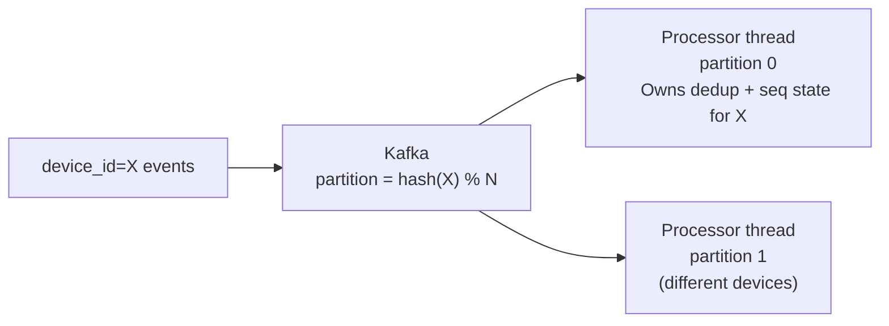

All events for the same `device_id` land on the same Kafka partition, processed by the same processor thread — no cross-thread coordination needed for per-device state.

### Concurrency Options Considered

| Option | Pros | Cons | Decision |
|--------|------|------|----------|
| **Kafka partition per device** | Per-device ordering for free; no global lock | Limits max parallelism to partition count | ✅ v1 |
| Global mutex on device state map | Simple | Bottleneck at high device count | ❌ |
| CRDT / vector clock per event | Handles arbitrary reordering | Complex; overkill for GPS streams | Deferred v3 |
| Actor per device (in-process) | Fine-grained parallelism | Memory overhead at millions of devices | Evaluate in v2 |

---

## Memory & Resource Budgets

### Location Processor (per partition)

| Component | Per-device size | At 100k devices |
|-----------|----------------|-----------------|
| Dedup window LRU cache | ~64 bytes per `(device_id, seq)` entry | ~6.4 MB |
| Per-device last_seq (in-memory shadow) | ~24 bytes | ~2.4 MB |
| Kafka consumer batch buffer | Configurable (default 4 MB) | 4 MB fixed |
| PostGIS write buffer (batch) | Configurable (default 2 MB) | 2 MB fixed |

### Query Service

| Component | Default | Configurable |
|-----------|---------|--------------|
| Redis connection pool | 32 connections | Yes |
| PostGIS connection pool | 16 connections | Yes |
| H3 ring result cache (LRU) | 64 MB | Yes |
| In-flight nearby query slots | 1000 concurrent | Yes |

### Geofence Engine

| Component | Default | Notes |
|-----------|---------|-------|
| Fence registry (in-memory) | ~1 MB per 1000 fences | Scales with polygon vertex count |
| Per-device fence state (Redis) | ~32 bytes per `(device, fence)` pair | Evicted after device inactivity |

---

## Fault Tolerance & Recovery

### Gateway Failure

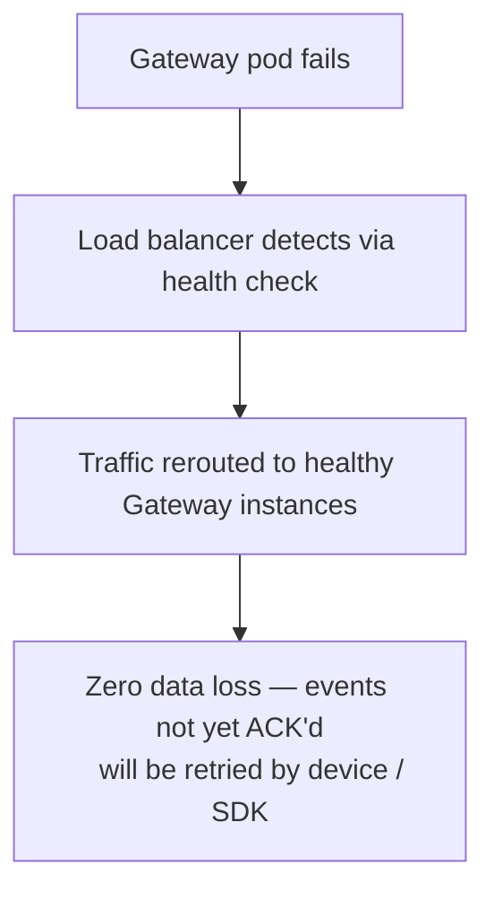

Gateways are stateless. Any failure is transparent to devices after retry.

### Processor Failure

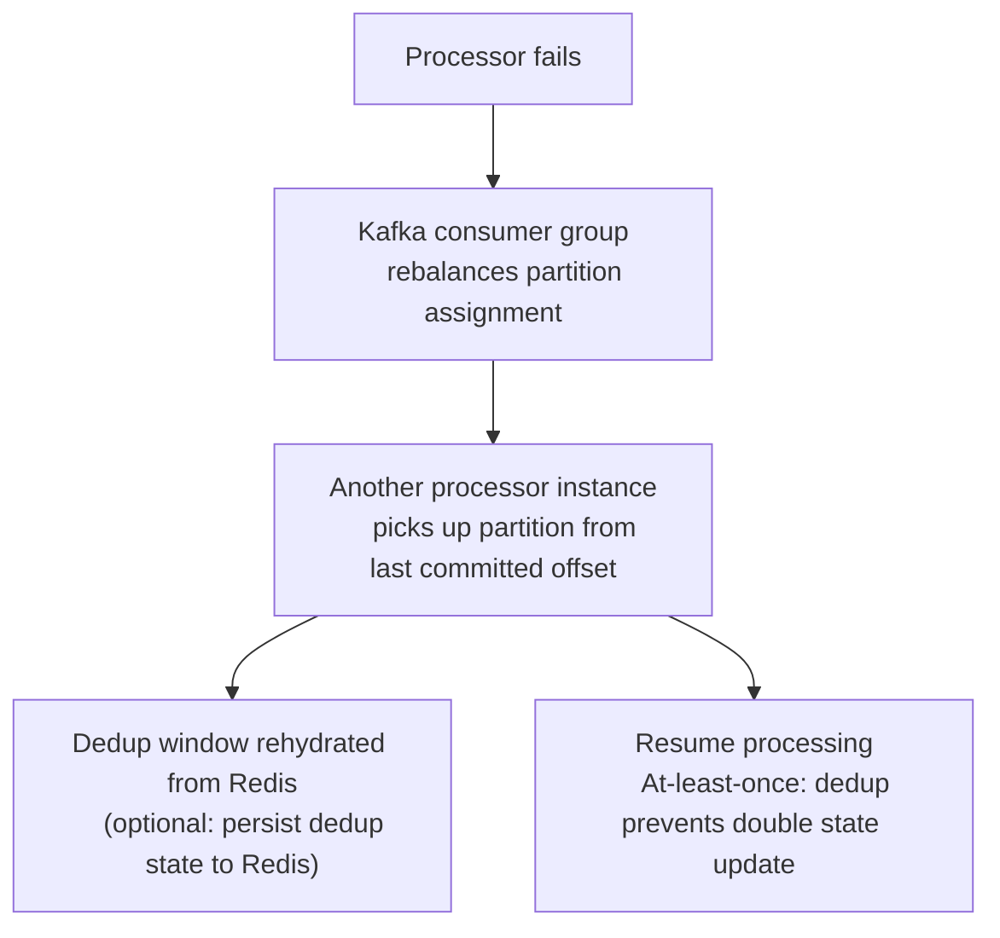

**Guarantee:** No permanently lost events — Kafka retains messages until offset is committed. State Store updates are idempotent via seq guard. Trip history inserts are idempotent via unique constraint.

### Redis Failure

| Mode | Impact | Recovery |
|------|--------|----------|
| Redis replica fails | None — reads/writes continue on primary | Replica auto-rejoin |
| Redis primary fails | Latest-location reads and state updates fail | Sentinel promotes replica; Processor buffers events for configurable backoff period |
| Redis cluster split | Writes rejected or split-brain; seq guard may fail | Use Redis Cluster with `WAIT` for critical writes |

### PostGIS Failure

Trip history writes buffer in Processor memory (configurable limit) or fall back to a dead-letter Kafka topic. Recovery replays from dead-letter topic once PostGIS is available.

---

## Scaling Strategy

### Ingestion Scaling

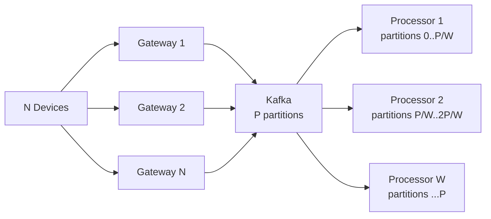

- **Gateways** scale horizontally — add pods behind a load balancer
- **Processors** scale by increasing Kafka partition count; each processor owns a partition group
- **Bottleneck:** Kafka partition count limits processor parallelism; plan partition count for peak load at cluster creation

### Read Scaling

- **Latest location:** Redis reads are O(1); Redis cluster handles millions of concurrent GETs
- **Nearby search:** Query Service is stateless; scale horizontally; H3 index lookup is O(cells in ring)
- **Trip replay:** PostGIS read replicas for analytical queries; time partitioning ensures only recent hypertable chunks are scanned

### Geofence Scaling

| Scale axis | Strategy |
|------------|---------|
| More devices | Geofence Engine is event-driven; evaluation rate scales with event throughput, not device count |
| More fences | H3 pre-filter eliminates most fences before polygon test; parallelizable per fence batch |
| More complex polygons | Simplify polygons at ingest time; use R-tree internally per engine instance |

---

## Configuration Reference

All configuration is provided via a TOML file.

| Section | Key Parameters |
|---------|---------------|
| `[server]` | `role`, `listen_addr`, `grpc_port`, `udp_port`, `tls_cert`, `tls_key` |
| `[kafka]` | `brokers`, `ingest_topic`, `geofence_topic`, `consumer_group`, `num_partitions`, `batch_size_bytes`, `linger_ms` |
| `[redis]` | `addrs`, `pool_size`, `connect_timeout_ms`, `read_timeout_ms`, `key_prefix`, `device_ttl_s` |
| `[postgis]` | `dsn`, `pool_size`, `write_batch_size`, `write_flush_interval_ms`, `query_timeout_ms` |
| `[processor]` | `dedup_ttl_s` (default 300), `sequence_guard_enabled`, `out_of_order_tolerance_s`, `history_batch_size`, `history_flush_interval_ms` |
| `[spatial]` | `h3_resolution` (default 7), `nearby_max_results`, `nearby_max_radius_m`, `h3_cache_size_mb` |
| `[geofence]` | `eval_enabled`, `dwell_threshold_s`, `max_fences`, `reload_interval_s` |
| `[gateway]` | `max_batch_size`, `max_batch_events`, `rate_limit_rps_per_device`, `timestamp_skew_tolerance_s` |
| `[threads]` | `io_threads`, `processor_threads`, `geofence_eval_threads`, `blocking_pool_size` |
| `[observability]` | `metrics_addr`, `metrics_path`, `log_level` |

---

## Design Decision Log

| # | Decision | Choice | Alternatives | Rationale |
|---|----------|--------|--------------|-----------| 
| D1 | Ingest protocol | gRPC (primary) + UDP (optional) | HTTP/1.1, MQTT, WebSocket | gRPC: schema enforcement, streaming, backpressure; UDP: minimal overhead for constrained devices willing to accept packet loss |
| D2 | Event ordering | Per-device sequence number guard | Vector clocks, Lamport timestamps, full ordering | GPS events only need per-device monotone order; sequence numbers are cheap and sufficient |
| D3 | State store | Redis | In-process hash map, ScyllaDB, DynamoDB | Sub-millisecond reads; atomic CAS via MULTI/EXEC; horizontal scale via Redis Cluster; ecosystem maturity |
| D4 | History store | TimescaleDB + PostGIS | ClickHouse, Apache Parquet, DynamoDB | Native time partitioning + native geospatial types in one system; full SQL for analytics; avoids separate spatial query layer |
| D5 | Spatial index | H3 at resolution 7 | R-tree, quadtree, geohash | H3 hexagons have uniform neighbor distance; cell IDs are integers (compact in Redis); k-ring expansion is O(k²); no tree traversal at query time |
| D6 | Deduplication | Sliding LRU window keyed by (device_id, seq) | Bloom filter, database unique check | Bounded memory; exact dedup within window; handles UDP retransmits and at-least-once Kafka delivery |
| D7 | Event queue | Kafka | NATS, RabbitMQ, custom ring buffer | Per-device ordering via partition key; replay for recovery; ecosystem tooling; exactly-once semantics available |
| D8 | Geofence evaluation model | Event-driven (triggered by state change) | Periodic polling of all devices | Scales with event throughput, not device count; enter/exit latency bounded by event cycle, not poll interval |
| D9 | Nearby query | H3 k-ring → candidate set → haversine filter | PostGIS ST_DWithin only, R-tree | H3 index fits in Redis memory; avoids full PostGIS table scan for real-time nearby; PostGIS used only for trip history |
| D10 | Out-of-order tolerance | Accept within 60s window; reject beyond | Reorder buffer per device, strict ordering | GPS delayed events are common (tunnels, poor connectivity); 60s is enough for most real-world lag without complex buffering |
| D11 | History write model | Batch insert with event_time timestamp | One INSERT per event, upsert by (device_id, seq) | Throughput: batching amortizes round-trip cost; correctness: event_time preserves real ordering even for late-arriving rows |

---

## Implementation Checklist

### Phase 0 — Single Node, Core Pipeline

- [ ] Protobuf schema: `LocationEvent`, `DeviceState`, `TripPoint`, `GeofenceRule`, `GeofenceEvent`
- [ ] Ingestion Gateway: gRPC server, schema validator, auth stub
- [ ] Event Queue: in-process channel (Kafka replaced in Phase 1)
- [ ] Location Processor: dedup window, seq guard, H3 encoder
- [ ] Location State Store: in-memory hash map (Redis replaced in Phase 1)
- [ ] Trip History Writer: PostGIS connection, batch insert, `(device_id, seq)` unique constraint
- [ ] Query Service: latest-location, basic nearby (full scan), trip replay
- [ ] H3 integration: `h3-cxx` library, cell encoding, k-ring expansion
- [ ] Configuration loader: TOML → config struct
- [ ] Observability: structured logging, basic Prometheus counter stubs

### Phase 1 — Full Pipeline + Spatial Index

- [ ] Kafka producer in Gateway (with partition routing by `device_id`)
- [ ] Kafka consumer in Location Processor (partition assignment)
- [ ] Redis integration: `HSET`, `HGETALL`, `SADD`/`SMEMBERS` for H3 cell index
- [ ] Sequence guard via Redis CAS (`MULTI`/`EXEC`)
- [ ] H3 cell index: `SADD h3:{cell} device_id` on state update, `SREM` on device eviction
- [ ] Nearby search: k-ring → Redis SMEMBERS → haversine filter
- [ ] Geofence Engine: fence registry, H3 polyfill, polygon containment (point-in-polygon)
- [ ] Geofence state in Redis: `device:{id}:fences`
- [ ] Geofence events published to Kafka topic
- [ ] Out-of-order tolerance window (configurable, default 60 s)
- [ ] UDP ingest socket (optional, alongside gRPC)

### Phase 2 — Distributed Scaling

- [ ] Stateless Gateway horizontal scaling (N instances behind load balancer)
- [ ] Redis Cluster configuration
- [ ] Processor scaling: partition rebalancing, dedup state handoff
- [ ] Backpressure: Gateway → Kafka flow control; Processor → PostGIS write buffer
- [ ] Dead-letter topic for failed PostGIS writes + replay mechanism
- [ ] Query Service horizontal scale (stateless read replicas)

### Phase 3 — Trip Analytics & Advanced Geofencing

- [ ] Trip segmentation: detect trip start/end by speed + inactivity threshold
- [ ] Dwell detection: device stationary inside geofence for > dwell_threshold_s
- [ ] Complex polygon geofences (concave, with holes)
- [ ] Map matching (optional): snap GPS track to road network
- [ ] Aggregate queries: total distance per device, average speed, stop frequency

### Phase 4 — Hardening

- [ ] Full Prometheus metrics: ingestion rate, seq guard rejects, dedup hits, nearby P99 latency, geofence eval latency
- [ ] Admin API: fence CRUD, cluster health, device info, force-evict device TTL
- [ ] Alerting pipeline: geofence events → webhook delivery with retry
- [ ] Load tests: 100k events/sec sustained, 10k concurrent nearby queries
- [ ] Chaos tests: Kafka broker failure, Redis primary failure, PostGIS unavailability

---

## Open Questions

| # | Question | Impact |
|---|----------|--------|
| Q1 | **H3 resolution per device group** — should different device types (vehicles vs. pedestrians) use different H3 resolutions? Requires multi-resolution index. | Medium |
| Q2 | **Redis vs. custom KV** — at 50M+ devices, Redis memory may become the bottleneck. Evaluate custom lock-free hash map with MMAP backing. | High |
| Q3 | **Exactly-once delivery** — current design is at-least-once with idempotent writes. Is exactly-once Kafka semantics worth the overhead for any use case? | Low |
| Q4 | **Cross-device spatial queries** — "find all devices that passed through this polygon in the last hour" requires both spatial and temporal filtering across all devices. PostGIS handles this but at what scale? | Medium |
| Q5 | **Device eviction** — how long should a device's state be retained after last seen? TTL in Redis is simple but loses history. Should eviction trigger archival? | Medium |
| Q6 | **Trip boundary detection** — automatic segmentation requires heuristics (speed threshold, time gap). What are the correct defaults, and should they be configurable per device type? | Low |

---

## Future Work

- **Map matching** — snap raw GPS coordinates to road segments using OSRM or Valhalla
- **Predictive location** — dead-reckoning extrapolation for devices with intermittent connectivity
- **S3 archival** — tier old trip history from PostGIS to Parquet on S3 for cost-efficient cold analytics
- **Multi-region** — active-active ingestion with eventual convergence of state per device
- **gRPC server streaming** — push latest-location updates to consumers without polling
- **Custom H3 resolution per fleet** — per-fleet or per-device-type resolution configuration
- **SIMD polygon containment** — vectorized point-in-polygon for high-density geofence evaluation
- **Rust or C++ WASM evaluation sandbox** — user-defined geofence logic as WASM plugins

---

## Related Documents

| Document | Description |
|----------|-------------|
| [components.md](./components.md) | Detailed component specifications |
| [storage/schema.md](./storage/schema.md) | Full data model and PostGIS table design |
| [storage/spatial.md](./storage/spatial.md) | H3 indexing, resolution trade-offs, k-ring math |
| [ingestion/pipeline.md](./ingestion/pipeline.md) | Dedup, out-of-order, sequence guard details |
| [query/spatial_ops.md](./query/spatial_ops.md) | Nearby search, geofencing, spatial filtering |
