# SignalRoute — Component Specifications

> **Related:** [architecture.md](./architecture.md)
> **Version:** 0.1 (Draft)

Detailed specifications for every component from the C3 diagrams.

---

## Table of Contents

1. [Ingestion Gateway](#ingestion-gateway)
2. [Event Queue (Kafka Layer)](#event-queue-kafka-layer)
3. [Location Processor](#location-processor)
4. [Dedup Window](#dedup-window)
5. [Sequence Guard](#sequence-guard)
6. [Location State Store](#location-state-store)
7. [Trip History Store](#trip-history-store)
8. [Query Service](#query-service)
9. [Geofence Engine](#geofence-engine)
10. [Background Workers](#background-workers)

---

## Ingestion Gateway

### Purpose

Stateless front-door for all device location events. Validates, authenticates, rate-limits, and enqueues events without maintaining any per-device state.

### Request Lifecycle

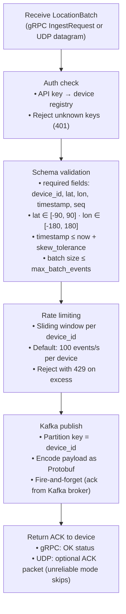

### Ingest API

| RPC | Request | Response | Notes |
|-----|---------|----------|-------|
| `IngestBatch` | `{ device_id, events[] }` | `{ accepted, rejected, reason }` | Primary gRPC method |
| `IngestSingle` | `LocationEvent` | `{ ok, reason }` | Convenience for single-event devices |

### UDP Mode

UDP mode is an opt-in alternative for devices that cannot afford TLS/HTTP overhead. Packets are self-contained Protobuf-encoded `LocationEvent` messages. The gateway accepts and enqueues them with no reliability guarantee — the device is responsible for retransmission. Rate limiting still applies.

### Error Responses

| Code | Condition |
|------|-----------|
| `INVALID_ARGUMENT` | Schema violation |
| `UNAUTHENTICATED` | Unknown or expired API key |
| `RESOURCE_EXHAUSTED` | Rate limit exceeded |
| `UNAVAILABLE` | Kafka producer backpressure |

---

## Event Queue (Kafka Layer)

### Purpose

Decouple ingestion from processing. Provides durable, ordered, replayable storage of location events, partitioned by `device_id` to guarantee per-device ordering.

### Topic Design

| Topic | Partitioning | Retention | Description |
|-------|-------------|-----------|-------------|
| `tm.location.events` | `hash(device_id) % N` | 24 h | Raw validated location events |
| `tm.geofence.events` | `hash(device_id) % N` | 7 days | Geofence enter/exit/dwell events for consumers |
| `tm.location.dlq` | round-robin | 30 days | Dead-letter queue for failed PostGIS writes |

### Partition Count

`num_partitions` is set at cluster creation and determines the maximum number of Processor instances. Rule of thumb: **1 partition per 10,000 active devices per second**. Cannot be changed without rebalancing consumers.

### Message Format (Protobuf)

```protobuf
message LocationEvent {
    string  device_id  = 1;
    double  lat        = 2;
    double  lon        = 3;
    float   altitude_m = 4;
    float   accuracy_m = 5;
    float   speed_ms   = 6;
    float   heading_deg = 7;
    int64   timestamp_ms = 8;   // device clock, Unix epoch ms
    int64   server_recv_ms = 9; // gateway receive time
    uint64  seq        = 10;    // monotonically increasing per device
    map<string, string> metadata = 11;
}
```

---

## Location Processor

### Purpose

Stateful per-partition consumer. Owns the correctness path: dedup, sequence guard, H3 encoding, state update, history write, geofence notification.

### Processing Loop

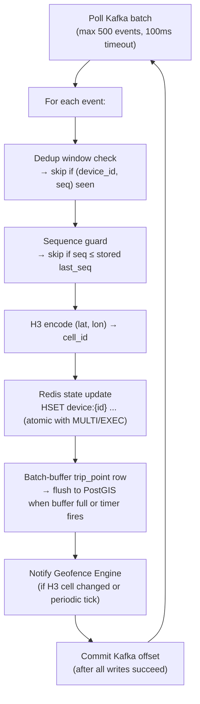

### Error Handling in Processing Loop

| Error | Action |
|-------|--------|
| Redis write timeout | Retry with exponential backoff (max 3 retries); then rewind Kafka offset and re-process |
| PostGIS write failure | Buffer to dead-letter topic `tm.location.dlq`; continue processing |
| H3 encoding error (invalid coords) | Log and discard (validation should have caught this; treat as corrupted event) |
| Geofence Engine unreachable | Log and continue; geofence eval is best-effort for transient failures |

---

## Dedup Window

### Purpose

Prevent duplicate state mutations caused by UDP retransmissions, Kafka at-least-once redelivery, or device retry logic.

### Data Structure

An **LRU hash set** keyed by `u64` fingerprint: `hash(device_id ‖ seq)`.

```mermaid
stateDiagram-v2
    [*] --> Miss : (device_id, seq) not found
    [*] --> Hit  : (device_id, seq) found
    Miss --> Insert : add to LRU; proceed to Sequence Guard
    Hit  --> Discard : increment dedup_hit_counter; skip event
    Insert --> Evict : LRU evicts oldest entry when capacity exceeded
    Evict --> [*]
```

### Configuration

| Parameter | Default | Notes |
|-----------|---------|-------|
| `dedup_ttl_s` | 300 (5 min) | Entries older than this are considered expired |
| `dedup_max_entries` | 500,000 per partition | Bounded memory; LRU evicts when full |

### Memory Cost

At 500,000 entries × 64 bytes each = **~32 MB per Processor instance**. This is the primary Processor memory cost.

---

## Sequence Guard

### Purpose

Ensure that only events strictly newer than the last accepted event for a device can update the Location State Store. Prevents stale GPS coordinates from overwriting fresh ones.

### Algorithm

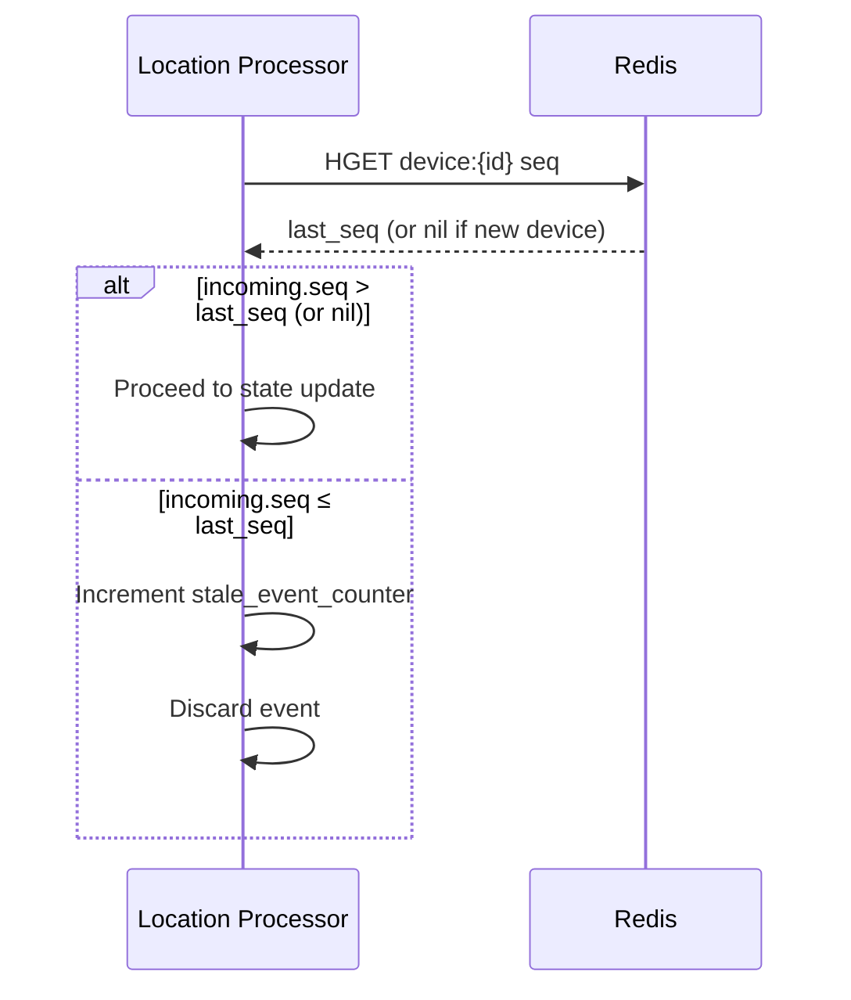

### Redis CAS for Atomic Update

State update uses `MULTI`/`EXEC` to atomically check-and-set `seq`:

```
MULTI
HGET  device:{id} seq           ← read current seq
HSET  device:{id} lat lon h3 seq updated_at
EXEC
```

The application layer checks the `HGET` result before deciding to commit. On a `nil` result (new device), the write proceeds unconditionally.

> **Note:** For high-throughput deployments consider Lua scripts (`EVALSHA`) to reduce round-trips.

### Out-of-Order Tolerance

Events that arrive late but within `out_of_order_tolerance_s` (default 60 s) of the current server time are still written to **trip history** with their original `event_time`, even if they fail the sequence guard for the State Store. This ensures history completeness without compromising the latest-position invariant.

---

## Location State Store

### Purpose

Single-record per device — the latest known position. Serves as the primary source of truth for all real-time reads.

### Redis Key Schema

| Key | Type | Fields |
|-----|------|--------|
| `{prefix}:dev:{device_id}` | Hash | `lat`, `lon`, `alt`, `accuracy`, `speed`, `heading`, `h3`, `seq`, `updated_at` |
| `{prefix}:h3:{cell_id}` | Set | `device_id` members — all devices currently in this H3 cell |

### H3 Cell Index Maintenance

On every accepted state update:

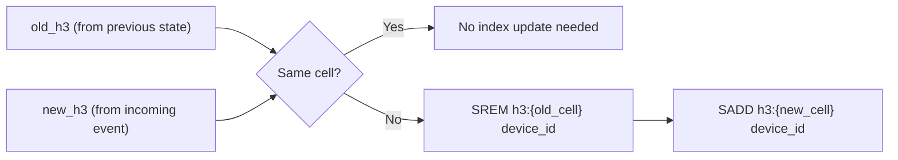

### Device TTL

Devices that have not sent an update in `device_ttl_s` (default 1 hour) are expired from Redis via TTL. The H3 cell index membership is cleaned up by the Background Cleanup Worker (see [Background Workers](#background-workers)).

---

## Trip History Store

### Purpose

Persistent append-only store of all accepted location events, enabling trip replay, analytics, distance calculation, and historical geofence queries.

### Schema

```sql
-- Hypertable: partitioned by event_time daily
CREATE TABLE trip_points (
    device_id   TEXT        NOT NULL,
    seq         BIGINT      NOT NULL,
    event_time  TIMESTAMPTZ NOT NULL,    -- device clock (original)
    recv_time   TIMESTAMPTZ NOT NULL,    -- gateway receive time
    location    GEOGRAPHY(Point, 4326) NOT NULL,
    altitude_m  REAL,
    accuracy_m  REAL,
    speed_ms    REAL,
    heading_deg REAL,
    h3_r7       BIGINT,                 -- H3 cell at resolution 7
    metadata    JSONB,
    PRIMARY KEY (device_id, seq)        -- idempotent inserts
);

SELECT create_hypertable('trip_points', 'event_time',
    chunk_time_interval => INTERVAL '1 day');

CREATE INDEX ON trip_points (device_id, event_time DESC);
CREATE INDEX ON trip_points USING GIST (location);
CREATE INDEX ON trip_points (h3_r7);
```

### Write Protocol

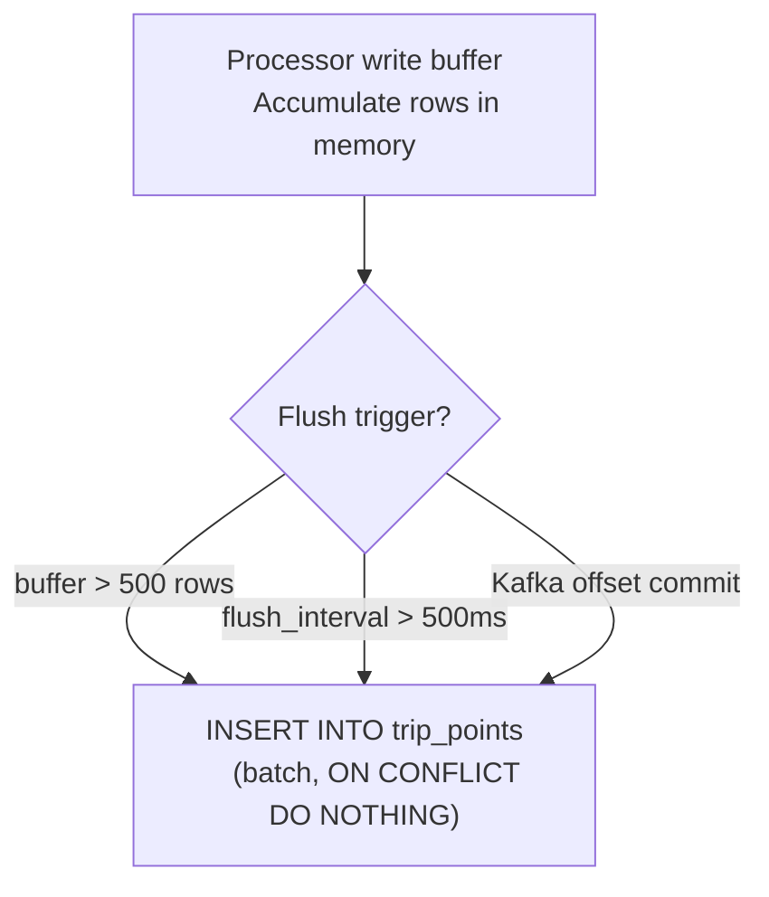

### Supported Queries

| Query | SQL Pattern | Index used |
|-------|-------------|-----------|
| Trip replay | `WHERE device_id=$1 AND event_time BETWEEN $2 AND $3` | `(device_id, event_time DESC)` |
| Latest N points | `WHERE device_id=$1 ORDER BY event_time DESC LIMIT N` | Same |
| Spatial range | `WHERE ST_DWithin(location, ST_Point($lon,$lat), $radius)` | GIST index |
| H3 cell history | `WHERE h3_r7 = $cell_id AND event_time > $from` | `h3_r7` + time |
| Distance traveled | `SUM(ST_Distance(lag(location) OVER ..., location))` | Sequential scan (analytics) |

---

## Query Service

### Purpose

Serves all consumer-facing read requests. Stateless — reads from Redis (latest, nearby) and PostGIS (history). Horizontally scalable.

### Latest Location Handler

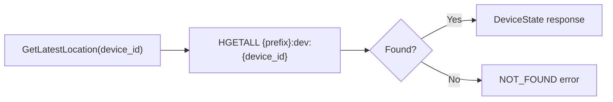

**SLA target:** P99 < 5 ms end-to-end (Redis HGETALL is typically < 1 ms on same network).

### Nearby Handler

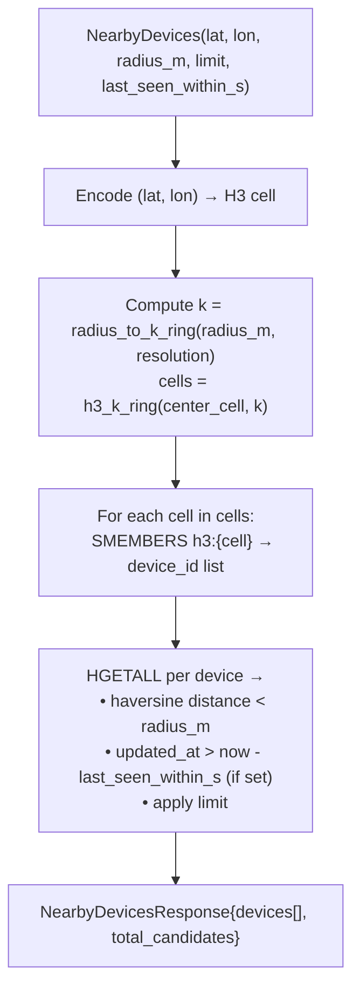

**k-ring radius formula:** `k = ceil(radius_m / h3_avg_edge_length_m(resolution))`

For resolution 7 (avg edge ~1.4 km):
- 1 km radius → k = 1 (7 cells)
- 5 km radius → k = 4 (61 cells)
- 10 km radius → k = 8 (217 cells)

### Trip Replay Handler

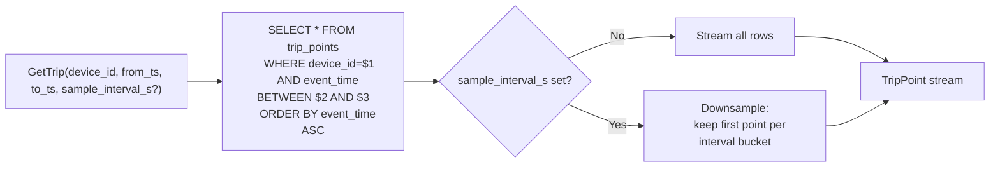

---

## Geofence Engine

### Purpose

Evaluates device position changes against registered geofences and emits enter/exit/dwell events to downstream consumers.

### Fence Registry

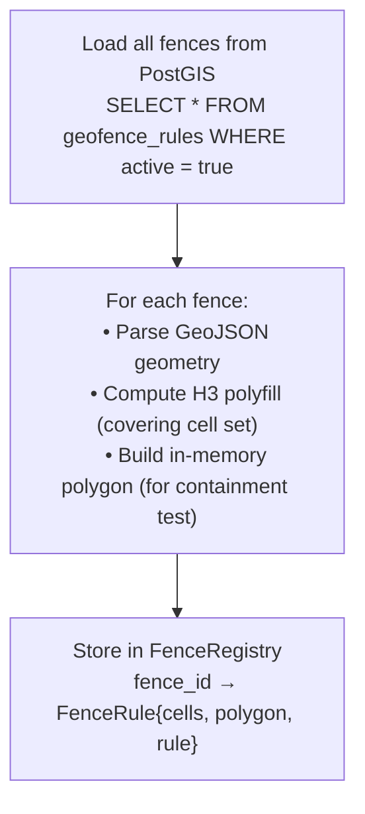

```sql
CREATE TABLE geofence_rules (
    fence_id    UUID PRIMARY KEY DEFAULT gen_random_uuid(),
    name        TEXT NOT NULL,
    geometry    GEOGRAPHY(Polygon, 4326) NOT NULL,
    h3_cells    BIGINT[] NOT NULL,     -- H3 polyfill at resolution 7
    active      BOOLEAN DEFAULT true,
    dwell_threshold_s INT DEFAULT 300,
    metadata    JSONB,
    created_at  TIMESTAMPTZ DEFAULT now()
);
CREATE INDEX ON geofence_rules USING GIN (h3_cells);
```

### Evaluation Flow

```mermaid
sequenceDiagram
    participant LP as Location Processor
    participant GE as Geofence Engine
    participant R  as Redis
    participant K  as Kafka

    LP->>GE: EvalRequest(device_id, old_h3, new_h3, lat, lon)
    GE->>GE: Find candidate fences:
              candidates = fences where h3_cells ∩ {new_h3} ≠ ∅
    loop For each candidate fence
        GE->>GE: ST_Contains(fence.polygon, (lat, lon))
        GE->>R: HGET device:{id}:fence:{fence_id} state
        R-->>GE: prior_state (OUTSIDE | INSIDE | DWELL)
        alt was OUTSIDE, now inside
            GE->>R: HSET device:{id}:fence:{fence_id} state=INSIDE ts=now
            GE->>K: Publish GeofenceEvent{type=ENTER, device_id, fence_id, ts}
        else was INSIDE, now outside
            GE->>R: HSET device:{id}:fence:{fence_id} state=OUTSIDE ts=now
            GE->>K: Publish GeofenceEvent{type=EXIT, device_id, fence_id, ts}
        end
    end
```

### Dwell Detection

A background timer in the Geofence Engine scans devices that are in `INSIDE` state and transitions them to `DWELL` if they have been continuously inside the fence for longer than `dwell_threshold_s`. A `DWELL` event is emitted to Kafka.

### Geofence Event Schema (Protobuf)

```protobuf
enum GeofenceEventType { ENTER = 0; EXIT = 1; DWELL = 2; }

message GeofenceEvent {
    string             device_id   = 1;
    string             fence_id    = 2;
    string             fence_name  = 3;
    GeofenceEventType  event_type  = 4;
    double             lat         = 5;
    double             lon         = 6;
    int64              event_ts_ms = 7;
    int64              inside_duration_s = 8;  // for DWELL
}
```

---

## Background Workers

All workers run as background threads within their respective service processes.

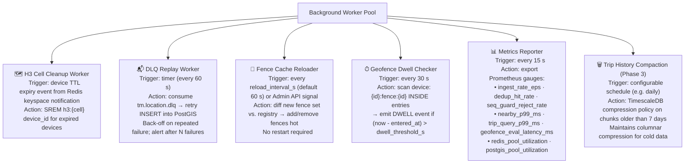

### DLQ Replay Worker — Detailed Flow

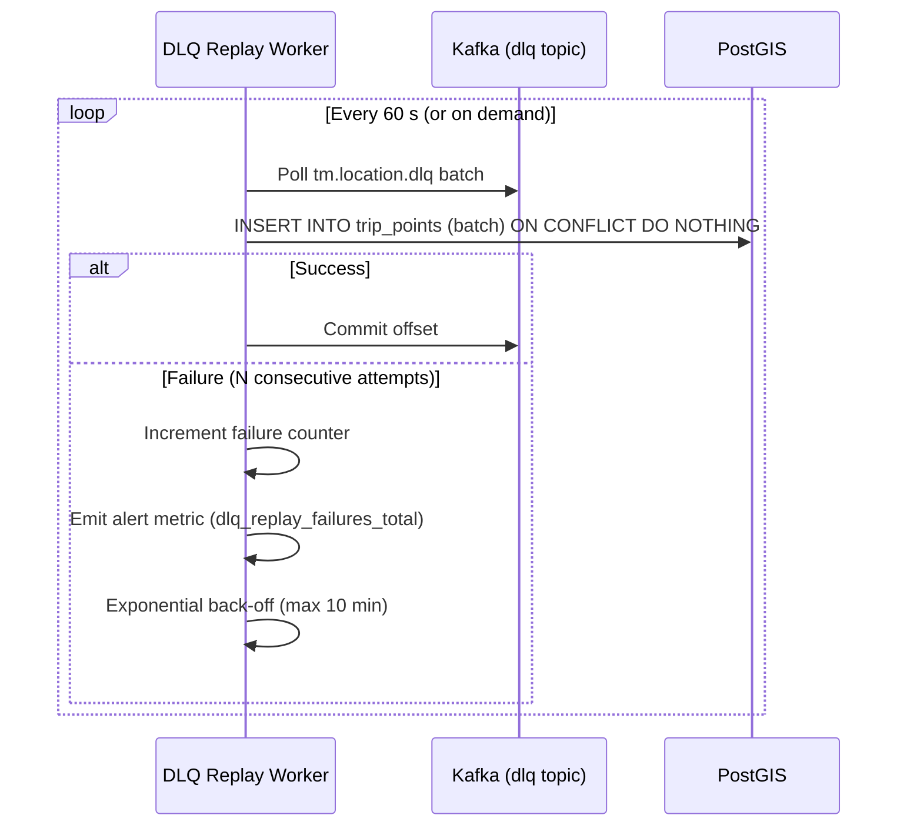
