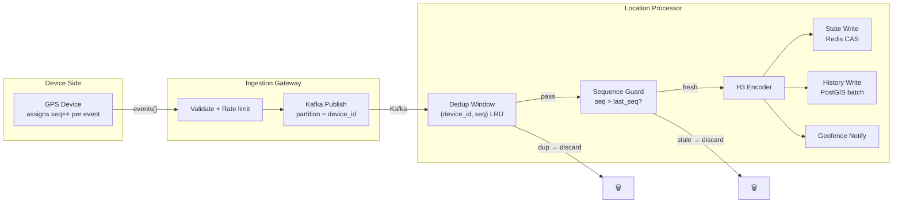
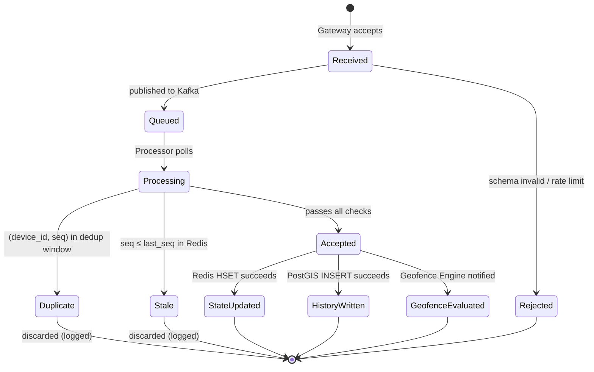
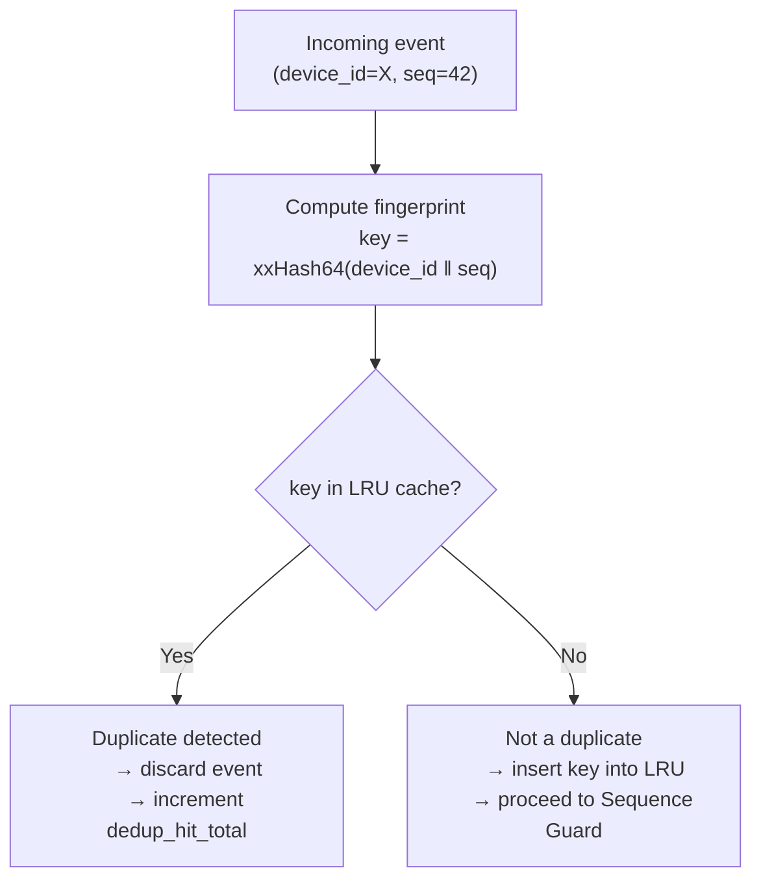
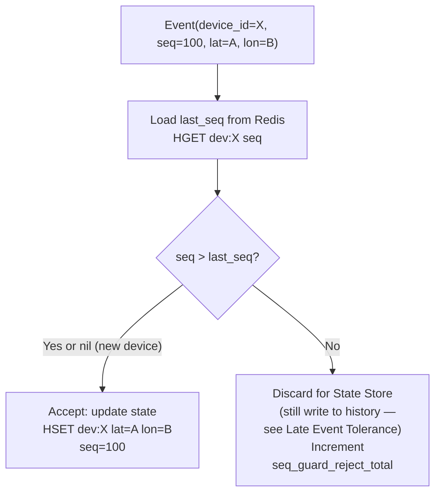
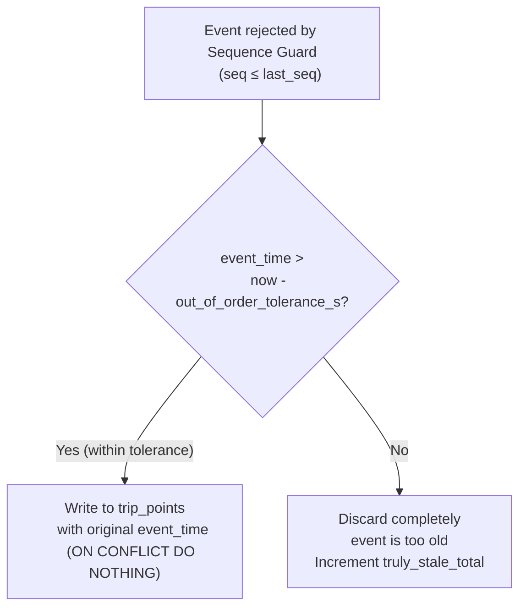
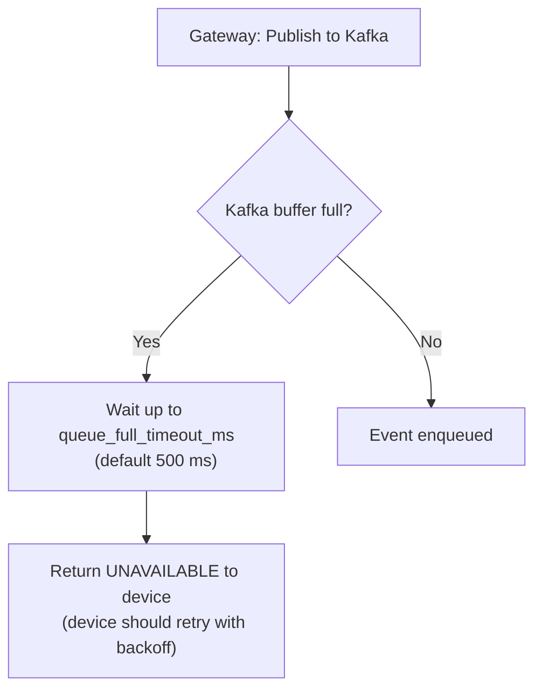
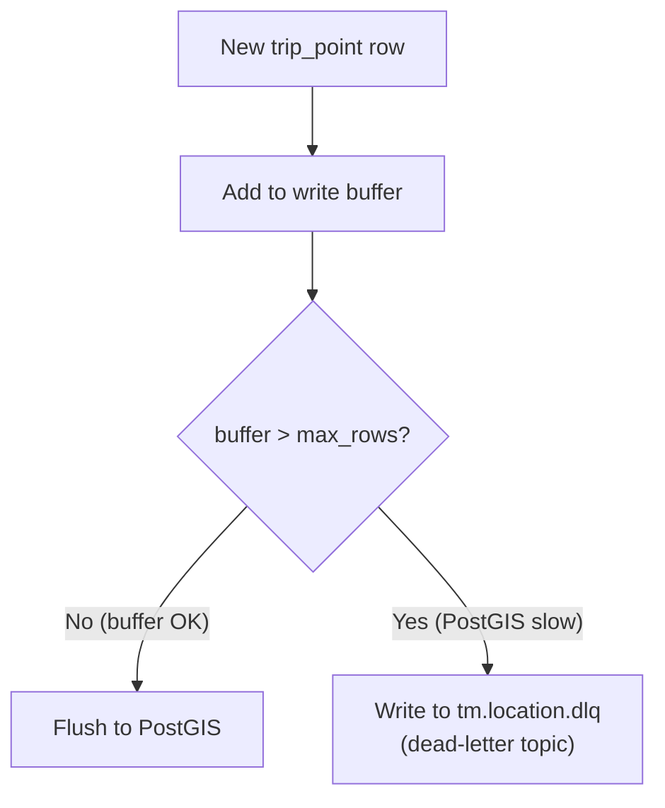

# SignalRoute — Ingestion Pipeline

> **Related:** [architecture.md](../architecture.md) · [components.md](../components.md)
> **Version:** 0.1 (Draft)

This document describes the full ingestion pipeline in detail: how location events flow from device to persistent storage, how duplicates are eliminated, how out-of-order events are handled, and how backpressure is applied.

---

## Table of Contents

1. [Pipeline Overview](#pipeline-overview)
2. [Event Lifecycle States](#event-lifecycle-states)
3. [Deduplication](#deduplication)
4. [Sequence Guard (Out-of-Order Handling)](#sequence-guard-out-of-order-handling)
5. [Late Event Tolerance](#late-event-tolerance)
6. [Backpressure](#backpressure)
7. [At-Least-Once Delivery Guarantees](#at-least-once-delivery-guarantees)
8. [Error Taxonomy](#error-taxonomy)
9. [Observability](#observability)

---

## Pipeline Overview



---

## Event Lifecycle States

Every location event transitions through a defined set of states:



| State | Counter | Notes |
|-------|---------|-------|
| `Received` | `ingest_received_total` | All events arriving at gateway |
| `Rejected` | `ingest_rejected_total{reason}` | Schema, rate-limit, auth failures |
| `Queued` | `ingest_queued_total` | Successfully published to Kafka |
| `Duplicate` | `dedup_hit_total` | Discarded by dedup window |
| `Stale` | `seq_guard_reject_total` | Discarded by sequence guard |
| `Accepted` | `events_accepted_total` | Proceeded to state + history write |

---

## Deduplication

### Why Deduplication Is Necessary

SignalRoute processes events **at-least-once** (Kafka semantics + device retransmissions). Without dedup:
- A device retransmitting an unACK'd UDP packet would write duplicate coordinates to the State Store and trip history
- Kafka consumer restarts after a crash would re-process events since the last committed offset
- Gateway retries on transient Kafka errors could publish the same event twice

### Dedup Window Design



**LRU eviction ensures bounded memory:** entries are evicted when the cache reaches `dedup_max_entries`. An evicted entry can theoretically be accepted again if it reappears after eviction — but this requires a very old retransmission arriving after at least `dedup_max_entries` newer events, which is negligible in practice.

### Fingerprint Collision Risk

xxHash64 has a 64-bit output. Collision probability for 500,000 entries is approximately 2⁻³³ — negligible. Even a collision would only cause one legitimate event to be treated as a duplicate.

### Dedup Window Persistence

In v1, the dedup window is **in-memory only**. On Processor restart, the window is empty. Protection against pre-restart duplicates comes entirely from the **Sequence Guard** (Redis-backed, persisted) — see next section.

This means: after a crash, the Sequence Guard prevents stale state updates, and the `ON CONFLICT DO NOTHING` constraint on `trip_points` prevents duplicate history rows. The dedup window's role is to reduce load on Redis and PostGIS during normal operation.

---

## Sequence Guard (Out-of-Order Handling)

### The Problem

GPS devices use their own clocks. Network conditions cause variable delivery delay. Two events from the same device with sequences 100 and 101 may arrive at the Processor in order 101 then 100.

Without a guard, event 100 arriving late would overwrite the freshly-written coordinates of event 101 in the State Store — regressing the device's position backward.

### Guard Algorithm



### Atomicity

State update uses a Redis Lua script to atomically read and conditionally write:

```lua
-- Executed atomically via EVALSHA
local current_seq = redis.call('HGET', KEYS[1], 'seq')
if current_seq == false or tonumber(ARGV[1]) > tonumber(current_seq) then
    redis.call('HMSET', KEYS[1],
        'lat', ARGV[2], 'lon', ARGV[3], 'h3', ARGV[4],
        'seq', ARGV[1], 'updated_at', ARGV[5])
    return 1  -- accepted
end
return 0  -- rejected (stale)
```

This replaces the `MULTI`/`EXEC` approach to reduce round-trips and eliminate the optimistic retry loop.

### Sequence Number Gaps

If a device sends seq 1, 2, 3, 5 (skipping 4), SignalRoute accepts all of 1, 2, 3, 5 without waiting for 4. There is no gap-fill requirement — the system does not buffer out-of-order events waiting for missing sequences. Event 4 arriving late will be:
- **Rejected by the State Store** (seq 4 ≤ last_seq 5)
- **Written to trip history** with its original `event_time` (tolerated as a late event within tolerance window)

---

## Late Event Tolerance

### Design

The sequence guard protects the **State Store** (latest position). But trip history is an append-only log that benefits from having all data, even late-arriving events.



| Parameter | Default | Effect |
|-----------|---------|--------|
| `out_of_order_tolerance_s` | 60 | Events up to 60 s late are still written to history |
| `truly_stale_threshold_s` | 300 | Events older than this are discarded entirely |

The history store (`trip_points`) uses `event_time` (device clock) for ordering, so late-written rows appear at the correct position in any time-range query.

---

## Backpressure

### Gateway → Kafka

When the Kafka producer's internal buffer is full, the gateway applies backpressure:



| Parameter | Default | Notes |
|-----------|---------|-------|
| `kafka_buffer_size_bytes` | 32 MB | Internal Kafka producer buffer |
| `queue_full_timeout_ms` | 500 | Wait before returning error |
| `linger_ms` | 5 | Batch accumulation window |

### Processor → PostGIS

The Processor accumulates trip point rows in a write buffer and flushes on either:

1. Buffer reaches `history_batch_size` rows (default 500)
2. `history_flush_interval_ms` timer fires (default 500 ms)
3. Kafka offset is about to be committed

If PostGIS is slow or unavailable, the buffer grows. Once the buffer exceeds `history_buffer_max_rows` (default 10,000), new incoming events are still processed for the State Store (Redis) but their history rows go to the dead-letter Kafka topic instead.



### Processor → Redis

Redis writes are synchronous (within the processing loop). If Redis is unavailable:
1. Retry with exponential backoff up to `redis_max_retries` (default 3)
2. If all retries fail: rewind the Kafka offset to the start of the current batch
3. The batch will be re-processed on the next poll cycle
4. Backoff interval grows up to `redis_backoff_max_ms` (default 5,000 ms)

---

## At-Least-Once Delivery Guarantees

| Layer | Guarantee | Idempotent? |
|-------|-----------|-------------|
| Device → Gateway | No guarantee (UDP); retry by device (gRPC) | N/A |
| Gateway → Kafka | At-least-once (Kafka producer with acks=all) | N/A |
| Kafka → Processor | At-least-once (manual offset commit after writes) | Dedup + seq guard |
| Processor → Redis | At-least-once (retry on failure + offset rewind) | Lua CAS script |
| Processor → PostGIS | At-least-once (DLQ replay on failure) | `ON CONFLICT DO NOTHING` |
| Processor → Geofence Engine | Best-effort (fire-and-forget notify) | Geofence state from Redis |

**No data loss for confirmed events:** an event that received a gateway ACK is guaranteed to be written to both the State Store and trip history, or retried until it is.

---

## Error Taxonomy

| Error | Location | Action | Metric |
|-------|----------|--------|--------|
| Schema violation | Gateway | Reject with `INVALID_ARGUMENT` | `ingest_rejected_total{reason="schema"}` |
| Auth failure | Gateway | Reject with `UNAUTHENTICATED` | `ingest_rejected_total{reason="auth"}` |
| Rate limit exceeded | Gateway | Reject with `RESOURCE_EXHAUSTED` | `ingest_rejected_total{reason="rate_limit"}` |
| Future timestamp | Gateway | Reject | `ingest_rejected_total{reason="future_ts"}` |
| Kafka publish failure | Gateway | Retry 3×; then reject to device | `kafka_publish_errors_total` |
| Duplicate event | Processor | Discard silently | `dedup_hit_total` |
| Stale seq (State Store) | Processor | Discard for State; write to history if within tolerance | `seq_guard_reject_total` |
| Truly stale event | Processor | Discard entirely | `truly_stale_total` |
| Redis timeout | Processor | Retry + offset rewind | `redis_write_errors_total` |
| PostGIS write failure | Processor | DLQ + Background retry | `postgis_write_errors_total` |
| H3 encoding error | Processor | Discard (should not occur post-validation) | `h3_encode_errors_total` |

---

## Observability

### Key Metrics

| Metric | Type | Description |
|--------|------|-------------|
| `ingest_received_total` | Counter | Events received at gateway |
| `ingest_rejected_total{reason}` | Counter | Events rejected at gateway |
| `ingest_queued_total` | Counter | Events successfully published to Kafka |
| `dedup_hit_total` | Counter | Events discarded by dedup window |
| `seq_guard_reject_total` | Counter | Events discarded by sequence guard (for State Store) |
| `truly_stale_total` | Counter | Events discarded entirely (beyond tolerance) |
| `events_accepted_total` | Counter | Events fully processed |
| `kafka_consumer_lag{partition}` | Gauge | Per-partition consumer lag |
| `redis_write_latency_ms` | Histogram | Redis HMSET latency |
| `postgis_write_latency_ms` | Histogram | PostGIS batch INSERT latency |
| `history_buffer_size` | Gauge | Current trip_points write buffer depth |
| `dlq_depth` | Gauge | Dead-letter topic backlog |

### Alerting Thresholds (Recommended)

| Condition | Threshold | Severity |
|-----------|-----------|----------|
| `kafka_consumer_lag > 10,000` | 5 min sustained | Warning |
| `kafka_consumer_lag > 100,000` | 1 min sustained | Critical |
| `seq_guard_reject_total` rate > 5% of accepted | — | Warning (device clock drift?) |
| `dlq_depth > 0` | 10 min sustained | Warning |
| `redis_write_latency_ms p99 > 50` | — | Warning |
| `postgis_write_latency_ms p99 > 500` | — | Warning |
