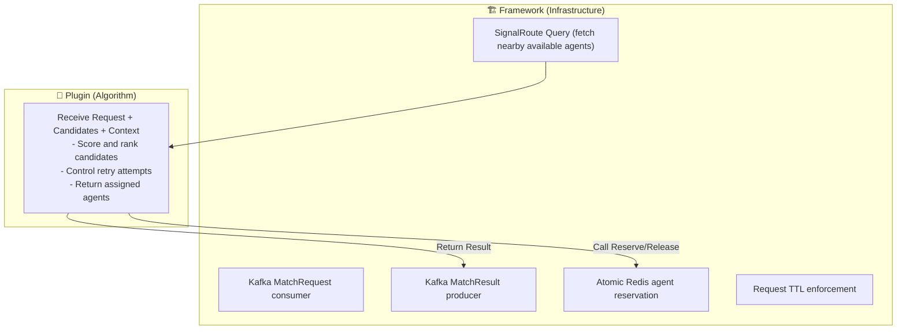
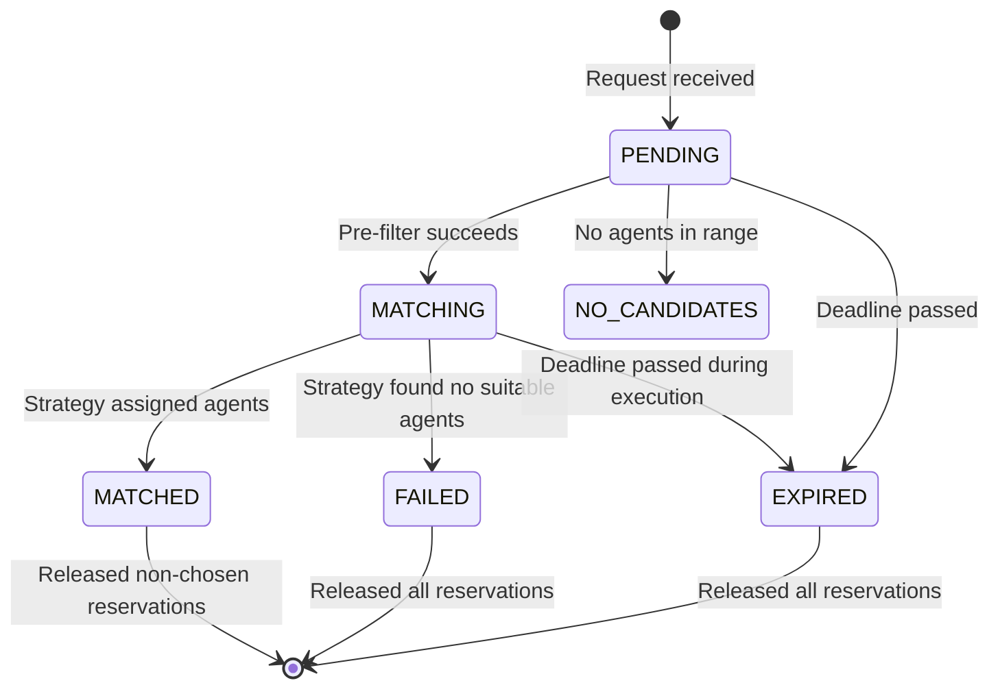

# SignalRoute — Matching Server Framework

> **Related:** [architecture.md](../architecture.md) · [components.md](../components.md) · [query/spatial_ops.md](../query/spatial_ops.md)
> **Version:** 0.1 (Draft) · **Last Updated:** 2026-04-18

This document describes the **Matching Server** — a service that provides a framework for implementing real-time matching between **Requesters** and **Agents**. It covers both the high-level architecture of the server and the developer guide for writing custom matching algorithms (plugins).

---

## Part 1: Architecture & Design

### Goals & Non-Goals

**Goals:**
- Provide a complete, production-ready matching request pipeline.
- Expose a clean, stable interface for plugging in custom algorithms.
- Support 1:1 and 1:N matching.
- Integrate natively with SignalRoute's Query Service and Geofence Engine.
- Enforce atomic agent reservation to prevent concurrent overlap.
- Be domain-agnostic (no assumption of riders vs. orders).

**Non-Goals:**
- Implementing specific matching logic (that is the plugin's job).
- Batch / auction-style matching (real-time only for v1).
- Agent-side acceptance flow (framework publishes match result, domain handles the rest).

### Concepts & Terminology
- **Requester:** The entity needing a match (e.g., rider, customer).
- **Agent:** The entity being matched (e.g., driver, courier).
- **MatchRequest:** A message submitted asking to find agents.
- **MatchCandidate:** An available, geographically pre-filtered agent delivered to the strategy.
- **MatchResult:** The outcome produced by the strategy (assigned agents or failure).
- **MatchContext:** A framework handle providing services like reservation and search expansion.
- **Reservation:** An atomic lock preventing another concurrent request from choosing the same agent.

### Framework vs. Plugin Boundary

### Match Lifecycle

### Deployment Architecture: Process Isolation
To support multiple business verticals (e.g., Food Delivery vs. Ride-Hailing) or A/B experiment algorithms, the Matching Server is designed to operate on a **One Strategy Per Process** model.
- **Kafka Topic Routing:** Each distinct strategy binds to its own dedicated Kafka topic (e.g., `sr.match.requests.food` vs `sr.match.requests.ride`).
- **Isolation:** A memory leak or crash in an Experimental algorithm will never affect the Production algorithm, since they run in completely separate OS processes.

### Execution Loop: Low-Latency Polling
To keep matching latency extremely low, the framework avoids blocking or putting threads to sleep while waiting for work. 
Instead, it employs an optimized **C++ Spin Loop** (a CPU busy-wait polling mechanism) on the Kafka Consumer. This ensures that the moment a `MatchRequest` arrives in the underlying network buffer, the dedicated thread instantly picks it up without suffering the latency overhead of OS thread context-switching.

### Agent Availability Model
SignalRoute maintains an availability state machine for agents in Redis, updated via Kafka events from domain services.
- **AVAILABLE:** Ready to be matched.
- **RESERVED:** Temporarily locked by a running match strategy.
- **ASSIGNED:** Successfully matched.
- **OFFLINE:** Disconnected or logged out.

---

## Part 2: Developer Guide

This section provides the conceptual steps for an engineer to implement, test, and deploy a custom matching strategy using the framework.

### The Developer Contract
As a strategy author, your responsibility is purely algorithmic. You do not write Kafka consumers, Redis operators, or network clients. 

You write a single strategy class. The framework provides you with:
- The requirements (who needs a match and where).
- The candidates (who is available nearby).
- The tools (a **MatchContext** object to reserve agents or expand the search).

You are expected to return a decision: which agents you matched, or a failure status.

### Step 1 — Implement the Strategy Interface
Your logic lives inside an `initialize()` setup method and a `match()` execution method.

**Initialization:** Use the startup phase to load configuration variables (e.g., scoring weights) from the central configuration tree. 

**The Match Workflow:**
1. **Check candidates:** If the pool is empty, you can either fail immediately or ask the framework to find more agents in a wider radius (`MatchContext.nearby()`).
2. **Score and sort:** Evaluate candidates based on distance, speed, and domain-specific attributes (like vehicle type). Sort them from most desirable to least.
3. **Time checks:** Frequently check the remaining time budget (`MatchContext.time_remaining()`). If time is running out, gracefully return what you have rather than letting the framework force-kill the request.
4. **Reserve agents:** Iterate through your top candidates and attempt to reserve them (`MatchContext.reserve()`). Because the system is highly concurrent, reservations can fail if another request claims the agent first. Handle this by simply moving to the next best candidate.
5. **Return results:** Return the final list of successfully reserved agents.

### Step 2 — Register the Plugin
Once the strategy class is written, register it with the framework's internal registry under a unique string name (e.g., `"my_domain_strategy"`). 

### Step 3 — Configure the Server
Activate your strategy by updating the SignalRoute `config.toml` to point to your new plugin name. Pass custom parameters underneath your plugin's configuration block.

### Step 4 — Unit and Integration Testing
- **Unit Testing:** The framework provides a `MockMatchContext` intended for unit tests. Inject this mock into your strategy class to simulate successful/failed reservations without a running database.
- **Integration Testing:** Run the full Matching Server binary locally with Kafka and Redis. Publish a test payload to the request topic and observe the results.

### Best Practices & Common Patterns
- **Multi-Round Search Expansion:** If the initial 2km radius yields no eligible agents, use the context to look within 5km before giving up.
- **Attribute-Based Filtering:** Rely on domain attributes passed through the metadata map to filter out incompatible candidates (e.g., bicycles for heavy cargo).
- **Graceful Degradation:** If a request has a 500ms deadline, and you have spent 450ms expanding the search or scoring, immediately attempt reservation on the best available candidates and return.
- **Clean up:** If you reserve 3 agents but eventually decide you only need 1, explicitly release the other 2 (`MatchContext.release()`).
