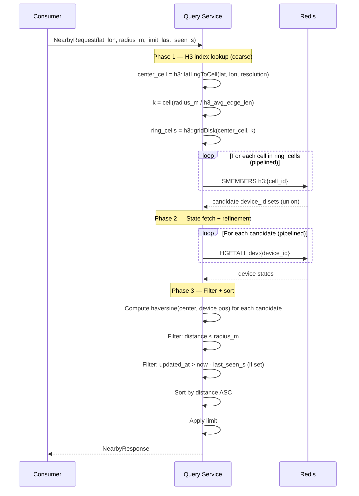
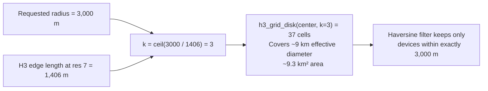
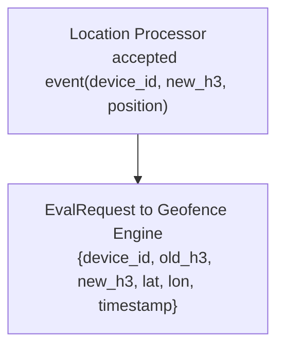
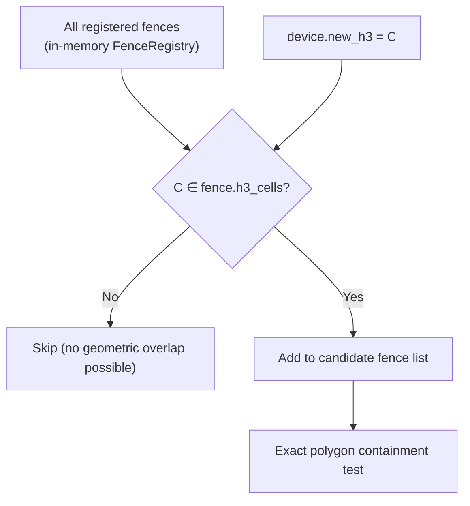
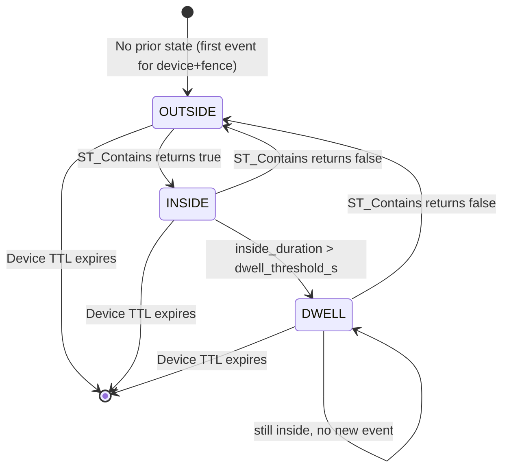
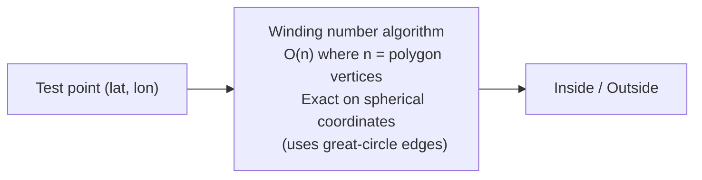

# SignalRoute — Spatial Operations

> **Related:** [architecture.md](../architecture.md) · [storage/spatial.md](../storage/spatial.md)
> **Version:** 0.1 (Draft)

This document covers how the Query Service and Geofence Engine implement the three primary spatial operations: nearby device search, geofence evaluation, and spatial history filtering.

---

## Table of Contents

1. [Nearby Device Search](#nearby-device-search)
2. [Geofence Evaluation](#geofence-evaluation)
3. [Spatial History Filtering](#spatial-history-filtering)
4. [Point-in-Polygon Algorithm](#point-in-polygon-algorithm)
5. [Distance Calculation](#distance-calculation)
6. [Performance Budgets & SLA](#performance-budgets--sla)
7. [Edge Cases & Correctness](#edge-cases--correctness)

---

## Nearby Device Search

### Query Interface

```protobuf
message NearbyRequest {
    double lat            = 1;
    double lon            = 2;
    double radius_m       = 3;   // max 50,000 m enforced server-side
    int32  limit          = 4;   // default 100, max 1000
    int32  last_seen_s    = 5;   // only include devices seen within N seconds
    bool   include_stale  = 6;   // if false: skip devices with updated_at > now - last_seen_s
    repeated string filter_metadata_keys = 7; // optional: filter by device metadata
}

message NearbyDevice {
    string device_id   = 1;
    double lat         = 2;
    double lon         = 3;
    double distance_m  = 4;
    int64  updated_at  = 5;
    float  speed_ms    = 6;
    float  heading_deg = 7;
}

message NearbyResponse {
    repeated NearbyDevice devices    = 1;
    int32                 total_candidates = 2;  // before limit applied
    int32                 total_in_radius  = 3;  // before limit applied
}
```

### Full Request Processing Flow



### k-ring Radius Correction

The k-ring with radius `k * h3_edge_length` is always slightly larger than the requested circle. An exact radius guarantee requires the Phase 3 haversine filter. The k is computed conservatively (ceiling) so no device inside the true circle is ever missed.



### Pipeline Batch Size

To avoid Redis round-trips, the Query Service batches SMEMBERS and HGETALL commands:

- **Batch 1:** All SMEMBERS in one pipeline (typically ≤ 61 commands for k=4)
- **Batch 2:** All HGETALL in one pipeline (typically ≤ 500 commands for the candidate set)
- Pipelines are issued via a single socket write + one response read

### Cache Layer (Optional, Phase 2)

Nearby queries for the same `(center_cell, k)` combination repeat often (e.g., map viewport refresh). A short-lived local LRU cache on the Query Service (TTL = 500 ms) can serve repeated queries without Redis round-trips:

| Parameter | Default |
|-----------|---------|
| `h3_ring_cache_size` | 10,000 entries |
| `h3_ring_cache_ttl_ms` | 500 |

---

## Geofence Evaluation

### Overview

Geofence evaluation is **event-driven**: it runs for every device whose state changes, not on a polling schedule. This ensures enter/exit latency is bounded by the event cycle (typically < 1 s end-to-end).

### Evaluation Trigger



The Processor sends an `EvalRequest` after every successful state write. In-process if Geofence Engine is co-located; gRPC if deployed separately.

### Pre-filter: H3 Cell Overlap

Before any polygon test, the Geofence Engine checks if the device's H3 cell intersects any registered fence's polyfill:



The H3 pre-filter eliminates the vast majority of fences for any given device. For a system with 1,000 fences covering different geographic areas, a device in a given H3 cell overlaps at most 2–5 fences on average.

### State Transitions



### Fence State in Redis

Fence state is persisted in Redis keyed by `{prefix}:fence:{device_id}:{fence_id}`:

| Transition | Redis Write | Kafka Event |
|-----------|-------------|-------------|
| OUTSIDE → INSIDE | `HMSET fence:{d}:{f} state=INSIDE entered_at=T` | `GeofenceEvent{type=ENTER}` |
| INSIDE → OUTSIDE | `HMSET fence:{d}:{f} state=OUTSIDE exited_at=T` | `GeofenceEvent{type=EXIT}` |
| INSIDE → DWELL | `HMSET fence:{d}:{f} state=DWELL` | `GeofenceEvent{type=DWELL}` |
| DWELL → OUTSIDE | `HMSET fence:{d}:{f} state=OUTSIDE exited_at=T` | `GeofenceEvent{type=EXIT}` |

### Evaluation Latency

End-to-end latency from GPS event origin to geofence event published:

| Step | Latency contribution |
|------|---------------------|
| Device transmission | 0–500 ms (network variable) |
| Gateway processing | < 1 ms |
| Kafka end-to-end (publish + poll) | 5–50 ms |
| Location Processor (dedup + seq guard + state write) | 2–10 ms |
| Geofence evaluation (H3 filter + polygon test) | < 1 ms |
| Kafka publish (geofence event) | 5–50 ms |
| **Total (typical)** | **< 200 ms** |

---

## Spatial History Filtering

### Overview

The Query Service supports spatial filters on trip history via PostGIS. Unlike real-time nearby (which uses the Redis H3 index), history spatial queries use PostGIS GIST indexes on the stored `GEOGRAPHY(Point)` column.

### Query Interface

```protobuf
message TripHistoryRequest {
    string device_id   = 1;   // optional: if absent, query all devices
    int64  from_ts     = 2;   // Unix epoch ms
    int64  to_ts       = 3;

    // Spatial filter (optional, applied after time filter)
    oneof spatial {
        CircleFilter circle   = 10;
        BBoxFilter   bbox     = 11;
    }

    int32  sample_interval_s = 20;  // 0 = all points; >0 = downsample
    int32  limit             = 21;  // max rows returned
}

message CircleFilter {
    double lat      = 1;
    double lon      = 2;
    double radius_m = 3;
}

message BBoxFilter {
    double min_lat = 1;  double min_lon = 2;
    double max_lat = 3;  double max_lon = 4;
}
```

### Circle Filter Query

```sql
SELECT device_id, event_time,
       ST_X(location::geometry) AS lon,
       ST_Y(location::geometry) AS lat,
       speed_ms, heading_deg
FROM trip_points
WHERE event_time BETWEEN $from AND $to
  AND device_id = $device_id   -- optional
  AND ST_DWithin(
        location,
        ST_Point($lon, $lat)::geography,
        $radius_m               -- meters, geodesic
      )
ORDER BY event_time ASC
LIMIT $limit;
```

**Index path:**
1. TimescaleDB chunk exclusion prunes chunks outside `[from, to]` time range
2. GIST index on `location` narrows to candidate rows within the bounding box
3. `ST_DWithin` computes exact geodesic distance for final filtering

### Bounding Box Query

```sql
SELECT device_id, event_time, location, speed_ms
FROM trip_points
WHERE event_time BETWEEN $from AND $to
  AND device_id = $device_id
  AND location && ST_MakeEnvelope($min_lon, $min_lat, $max_lon, $max_lat, 4326)::geography
ORDER BY event_time ASC
LIMIT $limit;
```

The `&&` operator uses the GIST index for fast bounding box intersection, with no expensive geodesic calculation required.

---

## Point-in-Polygon Algorithm

The Geofence Engine uses a **ray casting algorithm** for convex polygons and dispatches to PostGIS (`ST_Contains`) for complex polygons with holes.

### In-Process (Convex Polygon)

For simple convex fence polygons (the common case), the Geofence Engine runs point-in-polygon in C++ without a PostGIS round-trip:



**Implementation note:** Points and polygon edges are in WGS-84. For small fences (< 100 km across), planar approximation is sufficient. For larger fences, use spherical excess or dispatch to PostGIS.

### PostGIS Fallback (Complex Polygons)

For polygons with holes, self-intersections, or concave shapes registered via the Admin API with `complex_geometry=true`:

```sql
SELECT ST_Contains(
    (SELECT geometry FROM geofence_rules WHERE fence_id = $fence_id),
    ST_Point($lon, $lat)::geography
);
```

This is dispatched asynchronously — the Geofence Engine does not block the evaluation loop on PostGIS for simple fences.

### Algorithm Selection

| Fence type | Algorithm | Latency |
|------------|-----------|---------|
| Circle | Haversine distance ≤ radius | < 1 μs |
| Convex polygon | Winding number (in-process) | ~5 μs |
| Concave polygon | PostGIS ST_Contains | ~500 μs (network + SQL) |
| Polygon with holes | PostGIS ST_Contains | ~500 μs |

---

## Distance Calculation

All distance calculations use the **haversine formula** on WGS-84 coordinates. SignalRoute does not use Euclidean distance approximations (which become inaccurate at large distances or near poles).

### Haversine Formula

```
a = sin²(Δlat/2) + cos(lat1) × cos(lat2) × sin²(Δlon/2)
c = 2 × atan2(√a, √(1-a))
d = R × c        (R = 6,371,000 m)
```

**Precision:** Haversine accuracy is < 0.3% error worldwide. For SignalRoute workloads (radius < 50 km), the error is < 30 m — acceptable for all use cases.

**Performance (C++ SIMD):** With SIMD vectorization, haversine for 1,000 candidates takes ~50 μs on a modern CPU. This is not a bottleneck even at 10k concurrent nearby queries.

### PostGIS Distance

For trip history spatial queries, PostGIS uses `ST_DWithin` on `GEOGRAPHY` type — this uses geodesic (Vincenty) distance, which is more precise than haversine (~0.01% error). The Geofence Engine and Query Service use haversine for real-time paths; PostGIS handles analytics precision.

---

## Performance Budgets & SLA

### Nearby Search

| Operation | Budget | Notes |
|-----------|--------|-------|
| H3 k-ring computation | < 50 μs | Computed in C++ (no I/O) |
| Redis SMEMBERS (k=4, 61 cells) | < 5 ms | Pipelined |
| Redis HGETALL (500 candidates) | < 10 ms | Pipelined |
| Haversine filter (500 candidates) | < 100 μs | SIMD |
| **Total P50** | **< 15 ms** | |
| **Total P99 target** | **< 50 ms** | Includes Redis tail latency |

### Geofence Evaluation (per event)

| Operation | Budget | Notes |
|-----------|--------|-------|
| H3 pre-filter (1,000 fences) | < 10 μs | In-memory hash set |
| Polygon containment (5 candidates) | < 50 μs | In-process for convex |
| Redis fence state read | < 2 ms | |
| Redis fence state write | < 2 ms | |
| **Total P99 per event** | **< 10 ms** | |

### Spatial History Query

| Operation | Budget | Notes |
|-----------|--------|-------|
| PostGIS time-range pruning | < 1 ms | Chunk exclusion |
| PostGIS GIST spatial filter | 1–50 ms | Depends on result set size |
| Result streaming | Linear | |
| **P99 for 10k rows** | **< 200 ms** | 7-day hot window |

---

## Edge Cases & Correctness

| Edge Case | Handling |
|-----------|----------|
| Device exactly on fence boundary | `ST_Contains` in PostGIS returns `false` for boundary points; haversine filter uses strict `<` comparison — boundary device is `OUTSIDE`. Configurable via `boundary_mode = INCLUSIVE` |
| Circle fence crosses antimeridian (±180°) | PostGIS `GEOGRAPHY` type handles antimeridian correctly; haversine also handles it |
| Pole proximity | H3 pentagon cells near poles have slightly different shapes; polygon containment test still correct; k-ring slightly irregular |
| Zero-radius nearby query | Return only devices at the exact coordinate; practically: use radius = 1 m |
| Radius > 50 km | Rejected by Query Service (`INVALID_ARGUMENT`); very large radii produce too many H3 cells (k > 36 at res 7 = 3,781 cells) and stress Redis |
| Fence with 0 cells in polyfill | Rejected at geofence creation time; minimum fence area must cover at least 1 H3 cell at the configured resolution |
| Device TTL expires while inside fence | Background Cleanup Worker reads device fence state from Redis before eviction and emits a synthetic `EXIT` event |
