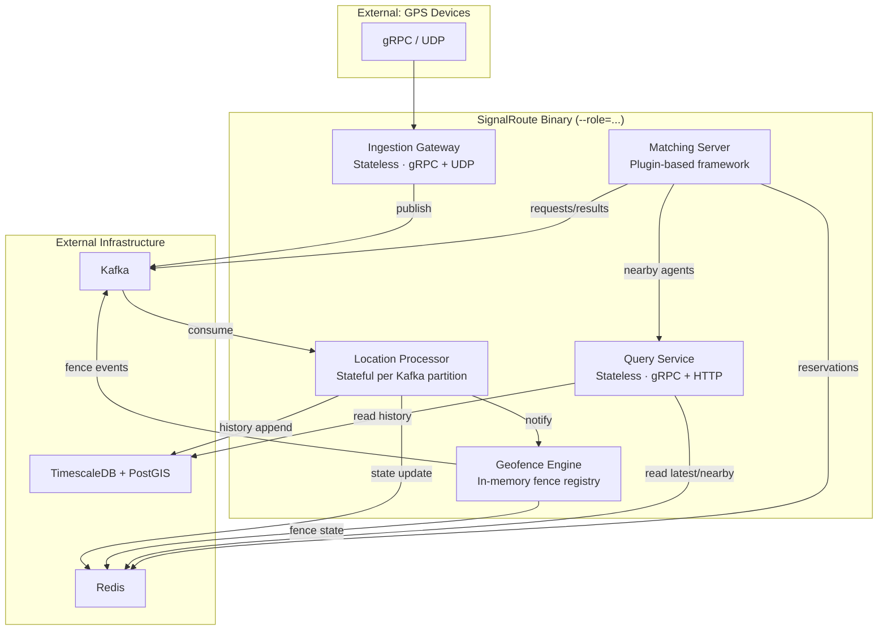

# SignalRoute — Software Architecture & Skeleton Code Plan

> **Goal:** Produce a project structure and skeleton codebase that allows a team of engineers to work in parallel on all major subsystems without deviating from the intended design.

---

## 1. High-Level Architecture

SignalRoute is a **single-binary, multi-role** C++ backend for real-time GPS/location tracking. The binary is invoked with `--role=<gateway|processor|query|geofence|matcher>` to run a specific service.

### Component Interaction Diagram



### Data Flow Summary

| Path | Flow | Latency Target |
|------|------|----------------|
| **Ingest** | Device → Gateway → Kafka → Processor → Redis + PostGIS | < 200 ms end-to-end |
| **Latest Read** | Consumer → Query Service → Redis | P99 < 5 ms |
| **Nearby Search** | Consumer → Query Service → Redis (H3 index) | P99 < 50 ms |
| **Trip Replay** | Consumer → Query Service → PostGIS | P99 < 200 ms |
| **Geofence Eval** | Processor → Geofence Engine → Redis + Kafka | < 10 ms per event |
| **Matching** | Kafka → Matching Server → Query Service → Redis → Kafka | < 500 ms |

---

## 2. Project Structure

```
SignalRoute/
├── CMakeLists.txt                          # Root build file
├── docs/                                   # Existing documentation (unchanged)
├── proto/                                  # Protobuf definitions
│   ├── signalroute/
│   │   ├── location.proto                  # LocationEvent, LocationBatch
│   │   ├── query.proto                     # NearbyRequest/Response, TripRequest/Response
│   │   ├── geofence.proto                  # GeofenceEvent, FenceRule
│   │   ├── matching.proto                  # MatchRequest, MatchResult, MatchCandidate
│   │   └── admin.proto                     # Health, metrics, fence CRUD
│   └── CMakeLists.txt
├── src/
│   ├── main.cpp                            # Entry point: parse --role, dispatch
│   ├── common/                             # Shared libraries (all services depend on this)
│   │   ├── CMakeLists.txt
│   │   ├── config/
│   │   │   ├── config.h                    # Configuration loading (TOML)
│   │   │   └── config.cpp
│   │   ├── types/
│   │   │   ├── location_event.h            # Core domain types
│   │   │   ├── device_state.h
│   │   │   ├── geofence_types.h
│   │   │   └── result.h                    # Result<T, E> error handling
│   │   ├── spatial/
│   │   │   ├── h3_index.h                  # H3 encoding, k-ring, polyfill
│   │   │   ├── h3_index.cpp
│   │   │   ├── haversine.h                 # Distance calculations
│   │   │   └── haversine.cpp
│   │   ├── metrics/
│   │   │   ├── metrics.h                   # Prometheus counters/gauges/histograms
│   │   │   └── metrics.cpp
│   │   ├── clients/
│   │   │   ├── redis_client.h              # Redis connection pool + Lua scripts
│   │   │   ├── redis_client.cpp
│   │   │   ├── postgres_client.h           # PostGIS connection pool
│   │   │   └── postgres_client.cpp
│   │   └── kafka/
│   │       ├── kafka_producer.h            # Async Kafka producer wrapper
│   │       ├── kafka_producer.cpp
│   │       ├── kafka_consumer.h            # Kafka consumer wrapper
│   │       └── kafka_consumer.cpp
│   ├── gateway/                            # Ingestion Gateway service
│   │   ├── CMakeLists.txt
│   │   ├── gateway_service.h              # Service lifecycle (start/stop)
│   │   ├── gateway_service.cpp
│   │   ├── grpc_server.h                  # gRPC IngestBatch/IngestSingle handlers
│   │   ├── grpc_server.cpp
│   │   ├── udp_server.h                   # UDP socket listener
│   │   ├── udp_server.cpp
│   │   ├── validator.h                    # Schema + coordinate + timestamp validation
│   │   ├── validator.cpp
│   │   ├── rate_limiter.h                 # Per-device sliding window rate limiter
│   │   └── rate_limiter.cpp
│   ├── processor/                         # Location Processor service
│   │   ├── CMakeLists.txt
│   │   ├── processor_service.h            # Service lifecycle
│   │   ├── processor_service.cpp
│   │   ├── dedup_window.h                 # LRU dedup cache
│   │   ├── dedup_window.cpp
│   │   ├── sequence_guard.h               # Seq > last_seq check
│   │   ├── sequence_guard.cpp
│   │   ├── state_writer.h                 # Redis state update (Lua CAS)
│   │   ├── state_writer.cpp
│   │   ├── history_writer.h               # PostGIS batch insert buffer
│   │   ├── history_writer.cpp
│   │   └── processing_loop.h/.cpp         # Main Kafka poll → process → commit loop
│   ├── query/                             # Query Service
│   │   ├── CMakeLists.txt
│   │   ├── query_service.h                # Service lifecycle
│   │   ├── query_service.cpp
│   │   ├── latest_handler.h               # GetLatestLocation handler
│   │   ├── latest_handler.cpp
│   │   ├── nearby_handler.h               # NearbyDevices handler
│   │   ├── nearby_handler.cpp
│   │   ├── trip_handler.h                 # GetTrip handler
│   │   └── trip_handler.cpp
│   ├── geofence/                          # Geofence Engine
│   │   ├── CMakeLists.txt
│   │   ├── geofence_engine.h              # Service lifecycle
│   │   ├── geofence_engine.cpp
│   │   ├── fence_registry.h               # In-memory fence store (RW-lock)
│   │   ├── fence_registry.cpp
│   │   ├── evaluator.h                    # H3 pre-filter + polygon containment
│   │   ├── evaluator.cpp
│   │   ├── point_in_polygon.h             # Ray-cast / winding number algorithm
│   │   ├── point_in_polygon.cpp
│   │   ├── dwell_checker.h                # Background dwell timer
│   │   └── dwell_checker.cpp
│   ├── matching/                          # Matching Server Framework
│   │   ├── CMakeLists.txt
│   │   ├── matching_service.h             # Service lifecycle
│   │   ├── matching_service.cpp
│   │   ├── match_context.h                # MatchContext interface (for plugins)
│   │   ├── match_context.cpp
│   │   ├── strategy_interface.h           # IMatchStrategy abstract class
│   │   ├── strategy_registry.h            # Registry: name → strategy factory
│   │   ├── strategy_registry.cpp
│   │   ├── reservation_manager.h          # Atomic Redis agent reservation
│   │   └── reservation_manager.cpp
│   └── workers/                           # Background workers
│       ├── CMakeLists.txt
│       ├── h3_cleanup_worker.h            # H3 cell cleanup on device TTL expiry
│       ├── h3_cleanup_worker.cpp
│       ├── dlq_replay_worker.h            # Dead-letter queue replay
│       ├── dlq_replay_worker.cpp
│       └── metrics_reporter.h/.cpp        # Prometheus metrics export
├── db/
│   └── migrations/
│       ├── 001_initial.sql
│       ├── 002_h3_column.sql
│       ├── 003_compression_policy.sql
│       └── 004_geofence_expiry.sql
├── tests/
│   ├── unit/
│   │   ├── test_dedup_window.cpp
│   │   ├── test_sequence_guard.cpp
│   │   ├── test_validator.cpp
│   │   ├── test_h3_index.cpp
│   │   ├── test_haversine.cpp
│   │   ├── test_point_in_polygon.cpp
│   │   ├── test_rate_limiter.cpp
│   │   └── test_fence_registry.cpp
│   └── integration/
│       ├── test_ingest_pipeline.cpp
│       ├── test_nearby_query.cpp
│       └── test_geofence_eval.cpp
└── config/
    └── signalroute.toml                   # Reference configuration file
```

---

## 3. Module Responsibilities

### 3.1 `common/` — Shared Libraries

| Sub-module | What it does | What it should NOT do |
|---|---|---|
| `config/` | Parse TOML config, provide typed access to all sections (`[server]`, `[kafka]`, `[redis]`, etc.) | Make service-level decisions; contain business logic |
| `types/` | Define domain types: `LocationEvent`, `DeviceState`, `GeofenceRule`, `Result<T,E>` | Implement serialization to/from external formats (that's proto's job) |
| `spatial/` | H3 encoding/decoding, k-ring expansion, polyfill, haversine distance | Own any state; talk to Redis or PostGIS |
| `metrics/` | Prometheus metric registration, increment, export | Business-level alerting logic |
| `clients/redis` | Redis connection pool, pipelined commands, Lua script execution | Own business key schemas (that's the caller's responsibility) |
| `clients/postgres` | libpq connection pool, prepared statements, batch insert | Own SQL schema or migrations |
| `kafka/` | Producer/consumer wrappers with config, batching, offset management | Own topic names or partition logic (configured externally) |

---

### 3.2 `gateway/` — Ingestion Gateway

| What it does | What it should NOT do |
|---|---|
| Accept gRPC (`IngestBatch`, `IngestSingle`) and UDP connections | Maintain per-device state |
| Authenticate via API key | Run dedup or sequence guard |
| Validate schema (required fields, coordinate ranges, timestamp bounds) | Write to Redis or PostGIS |
| Rate-limit per device | Decide event ordering |
| Publish validated events to Kafka (partition by `device_id`) | Transform or enrich events beyond server timestamp |

---

### 3.3 `processor/` — Location Processor

| What it does | What it should NOT do |
|---|---|
| Consume events from Kafka partition(s) | Accept external API requests |
| Run dedup window check (`device_id, seq`) | Serve read queries |
| Run sequence guard (reject stale events) | Own the H3 algorithm (delegates to `common/spatial`) |
| Encode `(lat, lon)` → H3 cell | Evaluate geofences (delegates to `geofence/`) |
| Update device state in Redis (Lua CAS) | |
| Batch-insert trip points to PostGIS | |
| Notify Geofence Engine on state change | |
| Commit Kafka offsets only after successful writes | |

---

### 3.4 `query/` — Query Service

| What it does | What it should NOT do |
|---|---|
| Serve gRPC/HTTP read queries | Write to Redis or PostGIS |
| `GetLatestLocation` → Redis HGETALL | Run dedup or seq guard |
| `NearbyDevices` → H3 k-ring → Redis SMEMBERS → haversine filter | Evaluate geofences |
| `GetTrip` → PostGIS range query with optional spatial filter | Consume Kafka events |

---

### 3.5 `geofence/` — Geofence Engine

| What it does | What it should NOT do |
|---|---|
| Load fence registry from PostGIS at startup | Accept external ingest events |
| Hot-reload fences via Admin API signal | Own the ingestion pipeline |
| H3 pre-filter: device cell ∩ fence cells | Write trip history |
| Exact polygon containment test (in-process for convex; PostGIS fallback) | Serve consumer queries (that's `query/`) |
| Manage per-device fence state in Redis (OUTSIDE/INSIDE/DWELL) | |
| Emit GeofenceEvent to Kafka | |
| Background dwell checker | |

---

### 3.6 `matching/` — Matching Server Framework

| What it does | What it should NOT do |
|---|---|
| Consume `MatchRequest` from Kafka | Implement specific matching algorithms |
| Fetch nearby available agents via Query Service | Own agent business logic |
| Provide `MatchContext` to strategy plugins (reserve, release, nearby, time_remaining) | Manage agent lifecycle beyond reservation |
| Enforce request TTL / deadline | |
| Publish `MatchResult` to Kafka | |
| Atomic agent reservation via Redis | |

---

### 3.7 `workers/` — Background Workers

| Worker | What it does |
|---|---|
| `H3CleanupWorker` | Listen to Redis keyspace notifications for device TTL expiry → SREM from H3 cell sets |
| `DLQReplayWorker` | Periodically consume `tm.location.dlq` → retry INSERT into PostGIS |
| `MetricsReporter` | Export Prometheus gauges/counters on a timer |

---

## 4. Key Interfaces / Contracts

### 4.1 Domain Types (`common/types/`)

```cpp
// location_event.h
struct LocationEvent {
    std::string device_id;
    double      lat;
    double      lon;
    float       altitude_m;
    float       accuracy_m;
    float       speed_ms;
    float       heading_deg;
    int64_t     timestamp_ms;      // device clock
    int64_t     server_recv_ms;    // gateway clock
    uint64_t    seq;               // monotonically increasing per device
    std::unordered_map<std::string, std::string> metadata;
};

// device_state.h
struct DeviceState {
    std::string device_id;
    double      lat;
    double      lon;
    float       altitude_m;
    float       accuracy_m;
    float       speed_ms;
    float       heading_deg;
    int64_t     h3_cell;           // H3 cell ID at configured resolution
    uint64_t    seq;
    int64_t     updated_at;        // Unix epoch ms
};

// geofence_types.h
enum class FenceState { OUTSIDE, INSIDE, DWELL };
enum class GeofenceEventType { ENTER, EXIT, DWELL };

struct GeofenceRule {
    std::string                fence_id;
    std::string                name;
    std::vector<std::pair<double,double>> polygon_vertices; // (lat, lon)
    std::unordered_set<int64_t>          h3_cells;          // polyfill
    int                        dwell_threshold_s;
    bool                       active;
};

struct GeofenceEvent {
    std::string        device_id;
    std::string        fence_id;
    std::string        fence_name;
    GeofenceEventType  event_type;
    double             lat;
    double             lon;
    int64_t            event_ts_ms;
    int                inside_duration_s;  // for DWELL
};

// result.h
template<typename T, typename E = std::string>
class Result {
    // Either holds a T (success) or an E (error)
    // Prevents exception-based control flow in hot paths
};
```

---

### 4.2 Spatial Interface (`common/spatial/`)

```cpp
// h3_index.h
class H3Index {
public:
    explicit H3Index(int resolution);  // default: 7

    /// Encode a GPS coordinate to an H3 cell ID
    int64_t lat_lng_to_cell(double lat, double lon) const;

    /// Compute k-ring: all cells within k steps of center
    std::vector<int64_t> grid_disk(int64_t center_cell, int k) const;

    /// Compute k from a radius in meters
    int radius_to_k(double radius_m) const;

    /// Polyfill: H3 cells covering a polygon
    std::vector<int64_t> polygon_to_cells(
        const std::vector<std::pair<double,double>>& polygon) const;

    int resolution() const;
};

// haversine.h
namespace geo {
    /// Haversine distance in meters between two WGS-84 points
    double haversine(double lat1, double lon1, double lat2, double lon2);
}
```

---

### 4.3 Redis Client Interface (`common/clients/`)

```cpp
// redis_client.h
class RedisClient {
public:
    explicit RedisClient(const RedisConfig& config);

    // Device state operations
    bool update_device_state_cas(const std::string& device_id,
                                  const DeviceState& state,
                                  int ttl_s);

    std::optional<DeviceState> get_device_state(const std::string& device_id);

    std::vector<DeviceState> get_device_states_batch(
        const std::vector<std::string>& device_ids);

    // H3 cell index operations
    void add_device_to_cell(int64_t cell_id, const std::string& device_id);
    void remove_device_from_cell(int64_t cell_id, const std::string& device_id);
    std::vector<std::string> get_devices_in_cell(int64_t cell_id);
    std::vector<std::string> get_devices_in_cells(const std::vector<int64_t>& cells);

    // Fence state operations
    void set_fence_state(const std::string& device_id,
                          const std::string& fence_id,
                          FenceState state, int64_t timestamp_ms);
    std::optional<FenceState> get_fence_state(const std::string& device_id,
                                               const std::string& fence_id);

    // Agent reservation (matching)
    bool try_reserve_agent(const std::string& agent_id,
                            const std::string& request_id, int ttl_ms);
    void release_agent(const std::string& agent_id,
                        const std::string& request_id);
};
```

---

### 4.4 PostgreSQL Client Interface (`common/clients/`)

```cpp
// postgres_client.h
class PostgresClient {
public:
    explicit PostgresClient(const PostGISConfig& config);

    // Trip history writes
    void batch_insert_trip_points(const std::vector<LocationEvent>& events);

    // Trip history reads
    std::vector<LocationEvent> query_trip(const std::string& device_id,
                                           int64_t from_ts, int64_t to_ts,
                                           int limit);

    std::vector<LocationEvent> query_trip_spatial(
        const std::string& device_id,
        int64_t from_ts, int64_t to_ts,
        double center_lat, double center_lon, double radius_m,
        int limit);

    // Geofence rules
    std::vector<GeofenceRule> load_active_fences();
    void insert_geofence_event(const GeofenceEvent& event);
};
```

---

### 4.5 Gateway Interfaces

```cpp
// validator.h
class Validator {
public:
    explicit Validator(const GatewayConfig& config);

    /// Validate a single event. Returns error reason or empty on success.
    Result<void, std::string> validate(const LocationEvent& event) const;

    /// Validate a batch. Returns per-event results.
    std::vector<Result<void, std::string>> validate_batch(
        const std::vector<LocationEvent>& events) const;
};

// rate_limiter.h
class RateLimiter {
public:
    explicit RateLimiter(int max_rps_per_device);

    /// Returns true if the event is allowed; false if rate-limited.
    bool allow(const std::string& device_id);
};
```

---

### 4.6 Processor Interfaces

```cpp
// dedup_window.h
class DedupWindow {
public:
    DedupWindow(size_t max_entries, int ttl_seconds);

    /// Returns true if this (device_id, seq) has been seen before.
    bool is_duplicate(const std::string& device_id, uint64_t seq);

    /// Mark (device_id, seq) as seen.
    void mark_seen(const std::string& device_id, uint64_t seq);

    size_t size() const;
};

// sequence_guard.h
class SequenceGuard {
public:
    explicit SequenceGuard(RedisClient& redis);

    /// Check if event should be accepted for state update.
    /// Returns true if seq > stored last_seq (or device is new).
    bool should_accept(const std::string& device_id, uint64_t seq);
};

// state_writer.h
class StateWriter {
public:
    StateWriter(RedisClient& redis, H3Index& h3);

    /// Atomically update device state + H3 cell index.
    /// Returns true if accepted (seq > stored).
    bool write(const LocationEvent& event);
};

// history_writer.h
class HistoryWriter {
public:
    HistoryWriter(PostgresClient& pg, KafkaProducer& dlq, const ProcessorConfig& cfg);

    /// Buffer a trip point row for batch insert.
    void buffer(const LocationEvent& event);

    /// Flush buffered rows to PostGIS (or DLQ on failure).
    void flush();

    /// Returns current buffer depth.
    size_t buffer_size() const;
};
```

---

### 4.7 Query Handlers

```cpp
// latest_handler.h
class LatestHandler {
public:
    explicit LatestHandler(RedisClient& redis);

    std::optional<DeviceState> handle(const std::string& device_id);
};

// nearby_handler.h
class NearbyHandler {
public:
    NearbyHandler(RedisClient& redis, H3Index& h3, const SpatialConfig& cfg);

    struct NearbyResult {
        std::vector<std::pair<DeviceState, double>> devices; // state + distance_m
        int total_candidates;
        int total_in_radius;
    };

    NearbyResult handle(double lat, double lon, double radius_m,
                        int limit, int last_seen_s);
};

// trip_handler.h
class TripHandler {
public:
    explicit TripHandler(PostgresClient& pg);

    std::vector<LocationEvent> handle(const std::string& device_id,
                                       int64_t from_ts, int64_t to_ts,
                                       int sample_interval_s, int limit);
};
```

---

### 4.8 Geofence Interfaces

```cpp
// fence_registry.h
class FenceRegistry {
public:
    /// Load all active fences from PostGIS.
    void load(PostgresClient& pg);

    /// Hot-reload: diff and apply changes.
    void reload(PostgresClient& pg);

    /// Get candidate fences whose H3 polyfill contains the given cell.
    std::vector<const GeofenceRule*> get_candidates(int64_t h3_cell) const;

    /// Thread-safe: uses shared_mutex (read-heavy, rare writes).
    size_t fence_count() const;
};

// evaluator.h
class Evaluator {
public:
    Evaluator(FenceRegistry& registry, RedisClient& redis,
              KafkaProducer& event_producer, PostgresClient& pg);

    /// Evaluate a device's state change against all candidate fences.
    /// Emits GeofenceEvents for any state transitions.
    void evaluate(const std::string& device_id,
                  int64_t old_h3, int64_t new_h3,
                  double lat, double lon, int64_t timestamp_ms);
};

// point_in_polygon.h
namespace geo {
    /// Winding number test for convex/simple polygons.
    bool point_in_polygon(double lat, double lon,
                          const std::vector<std::pair<double,double>>& vertices);
}
```

---

### 4.9 Matching Server Interfaces

```cpp
// strategy_interface.h — THE PLUGIN CONTRACT
class IMatchStrategy {
public:
    virtual ~IMatchStrategy() = default;

    /// Called once at startup with the strategy's config subtree.
    virtual void initialize(const Config& config) = 0;

    /// Core matching function. Called by the framework per MatchRequest.
    /// The strategy receives pre-filtered candidates and a context for
    /// reservations, search expansion, and time management.
    ///
    /// Returns: list of matched agent IDs, or empty on failure.
    virtual std::vector<std::string> match(
        const MatchRequest& request,
        const std::vector<MatchCandidate>& candidates,
        MatchContext& context) = 0;

    /// Human-readable name for logging/metrics.
    virtual std::string name() const = 0;
};

// match_context.h — FRAMEWORK SERVICES EXPOSED TO PLUGINS
class MatchContext {
public:
    /// Attempt to atomically reserve an agent for this request.
    /// Returns true if reservation succeeded.
    virtual bool reserve(const std::string& agent_id) = 0;

    /// Release a previously reserved agent.
    virtual void release(const std::string& agent_id) = 0;

    /// Expand search: fetch agents in a wider radius.
    virtual std::vector<MatchCandidate> nearby(
        double lat, double lon, double radius_m, int limit) = 0;

    /// Remaining time before the request deadline (milliseconds).
    virtual int64_t time_remaining_ms() const = 0;

    /// The unique request ID (for reservation tracking).
    virtual const std::string& request_id() const = 0;

    virtual ~MatchContext() = default;
};

// strategy_registry.h
class StrategyRegistry {
public:
    using Factory = std::function<std::unique_ptr<IMatchStrategy>()>;

    void register_strategy(const std::string& name, Factory factory);
    std::unique_ptr<IMatchStrategy> create(const std::string& name) const;
};
```

---

### 4.10 Service Lifecycle Interface

All services implement a common lifecycle interface:

```cpp
// Each service (gateway, processor, query, geofence, matching) implements:
class IService {
public:
    virtual ~IService() = default;

    /// Initialize: load config, open connections, warm up caches.
    virtual void start(const Config& config) = 0;

    /// Graceful shutdown: drain in-flight work, close connections.
    virtual void stop() = 0;

    /// Health check for liveness probes.
    virtual bool is_healthy() const = 0;
};
```

---

## 5. Skeleton Code Plan

Below are the key skeleton files engineers should create. Each contains method signatures, doc-comments, and TODOs — **no business logic implementation**.

> [!IMPORTANT]
> **Phase 0 Target:** In Phase 0, all services run in a single process. The Geofence Engine is called in-process by the Processor (no gRPC). Kafka can be replaced with an in-process queue. Redis and PostGIS are external dependencies.

### 5.1 Entry Point: `src/main.cpp`

```cpp
#include <iostream>
#include <string>
#include "common/config/config.h"
// #include each service header

int main(int argc, char* argv[]) {
    // TODO: Parse command-line arguments:
    //   --role=<gateway|processor|query|geofence|matcher|standalone>
    //   --config=<path-to-toml>
    //
    // In "standalone" mode (Phase 0), start all services in-process.
    //
    // TODO: Load Config from TOML file
    // TODO: Initialize global metrics registry
    // TODO: Based on --role, instantiate and start the appropriate IService
    // TODO: Register SIGTERM/SIGINT handler for graceful shutdown
    // TODO: Block until shutdown signal, then call service->stop()

    return 0;
}
```

### 5.2 Config: `src/common/config/config.h`

```cpp
#pragma once
#include <string>
#include <optional>

// TODO: Use a TOML parsing library (e.g., toml++ or toml11)

struct ServerConfig {
    std::string role;          // gateway | processor | query | geofence | matcher
    std::string listen_addr;
    int         grpc_port;
    int         udp_port;
    // TODO: TLS cert/key paths
};

struct KafkaConfig {
    std::string brokers;
    std::string ingest_topic;       // "tm.location.events"
    std::string geofence_topic;     // "tm.geofence.events"
    std::string dlq_topic;          // "tm.location.dlq"
    std::string consumer_group;
    int         num_partitions;
    int         batch_size_bytes;
    int         linger_ms;
};

struct RedisConfig {
    std::string addrs;
    int         pool_size;
    int         connect_timeout_ms;
    int         read_timeout_ms;
    std::string key_prefix;         // default: "sr"
    int         device_ttl_s;       // default: 3600
};

struct PostGISConfig {
    std::string dsn;
    int         pool_size;
    int         write_batch_size;
    int         write_flush_interval_ms;
    int         query_timeout_ms;
};

struct ProcessorConfig {
    int  dedup_ttl_s;               // default: 300
    int  dedup_max_entries;         // default: 500000
    bool sequence_guard_enabled;    // default: true
    int  out_of_order_tolerance_s;  // default: 60
    int  history_batch_size;        // default: 500
    int  history_flush_interval_ms; // default: 500
    int  history_buffer_max_rows;   // default: 10000
};

struct SpatialConfig {
    int    h3_resolution;           // default: 7
    int    nearby_max_results;      // default: 1000
    double nearby_max_radius_m;     // default: 50000
    int    h3_cache_size_mb;        // default: 64
};

struct GeofenceConfig {
    bool eval_enabled;
    int  dwell_threshold_s;         // default: 300
    int  max_fences;
    int  reload_interval_s;         // default: 60
};

struct GatewayConfig {
    int max_batch_events;           // default: 1000
    int rate_limit_rps_per_device;  // default: 100
    int timestamp_skew_tolerance_s; // default: 30
};

struct MatchingConfig {
    std::string strategy_name;      // plugin name
    std::string request_topic;      // e.g., "sr.match.requests.food"
    std::string result_topic;       // e.g., "sr.match.results.food"
    int         request_ttl_ms;     // default: 5000
    // TODO: Strategy-specific config subtree
};

struct ThreadConfig {
    int io_threads;
    int processor_threads;
    int geofence_eval_threads;
    int blocking_pool_size;
};

class Config {
public:
    /// Load configuration from a TOML file.
    static Config load(const std::string& path);

    ServerConfig    server;
    KafkaConfig     kafka;
    RedisConfig     redis;
    PostGISConfig   postgis;
    ProcessorConfig processor;
    SpatialConfig   spatial;
    GeofenceConfig  geofence;
    GatewayConfig   gateway;
    MatchingConfig  matching;
    ThreadConfig    threads;
};
```

---

## 6. Design Rationale

### Why single-binary, multi-role?

All services share the same domain types, Protobuf definitions, and client libraries. A single CMake build produces one binary; `--role` selects the service at startup. This simplifies CI/CD (one artifact), development (one repo), and Phase 0 deployment (all services in one process via `--role=standalone`).

### Why this module layout?

| Decision | Rationale |
|----------|-----------|
| `common/` as a shared library | Every service needs config, types, spatial, metrics, and data clients. Centralizing these prevents duplication and ensures consistent behavior. |
| Each service in its own directory | Clear ownership boundaries. An engineer working on `gateway/` does not need to touch `processor/` code. |
| `types/` separate from `proto/` | Internal C++ types are decoupled from wire-format Protobuf types. Conversion functions live at the service boundary. |
| `workers/` as a standalone module | Background tasks (cleanup, DLQ, metrics) are orthogonal to the request-serving services and can be refactored independently. |
| `matching/strategy_interface.h` as the plugin boundary | The `IMatchStrategy` is the only class domain engineers extend. Everything else (Kafka I/O, reservation, timeouts) is framework-owned. |

### Why `Result<T, E>` instead of exceptions?

The ingestion and query hot paths process >100k events/sec. Exception-based error handling has unpredictable cost on the throw path. `Result<T,E>` makes error handling explicit and zero-cost on the success path.

### Why Lua scripts for Redis CAS?

A single `EVALSHA` call atomically reads `last_seq` and conditionally writes, eliminating the MULTI/EXEC round-trip and the optimistic retry loop. This is critical for the Processor's throughput under contention.

### Phase 0 simplifications

| Component | Phase 0 | Phase 1+ |
|-----------|---------|----------|
| Event queue | Kafka (required from Phase 0) | Kafka (scaled partitions) |
| Service communication | Direct function calls (same process) | gRPC |
| State Store | External Redis (required from Phase 0) | Redis Cluster |
| History Store | External PostGIS (required from Phase 0) | PostGIS with read replicas |
| Matching Server | Included in Phase 0 skeleton | Strategy plugins + A/B routing |

---

## Resolved Decisions

> [!NOTE]
> **Build system dependencies (confirmed):**
> - **gRPC** (grpc++) — for service APIs
> - **Protobuf** (protoc) — for wire format
> - **hiredis** / **redis-plus-plus** — for Redis client
> - **libpq** / **libpqxx** — for PostGIS
> - **librdkafka** / **cppkafka** — for Kafka
> - **h3** (h3-cxx bindings) — for H3 spatial indexing
> - **toml++** or **toml11** — for TOML config parsing
> - **Prometheus C++ client** — for metrics

> [!NOTE]
> **Phase 0 scope:** Matching Server is **included** in Phase 0 skeleton.

> [!NOTE]
> **Event queue:** Kafka is required from day one. No in-process queue abstraction.

---

## Verification Plan

### Automated Tests
- Each module will have unit tests under `tests/unit/`:
  - `test_dedup_window.cpp` — LRU eviction, TTL, collision handling
  - `test_sequence_guard.cpp` — accept/reject logic, new device handling
  - `test_validator.cpp` — coordinate bounds, timestamp bounds, batch limits
  - `test_h3_index.cpp` — encoding, k-ring, polyfill against known values
  - `test_haversine.cpp` — distance accuracy against reference implementations
  - `test_point_in_polygon.cpp` — convex/concave cases, edge cases
  - `test_rate_limiter.cpp` — sliding window correctness
  - `test_fence_registry.cpp` — load, reload, candidate lookup

### Build Verification
```bash
cmake -B build -DCMAKE_BUILD_TYPE=Debug
cmake --build build
ctest --test-dir build --output-on-failure
```

### Integration Tests
- Require local Redis + PostGIS (Docker Compose)
- `test_ingest_pipeline.cpp` — end-to-end: event → gateway → processor → Redis + PostGIS
- `test_nearby_query.cpp` — seed devices → query → verify distance filtering
- `test_geofence_eval.cpp` — register fence → move device → verify ENTER/EXIT events
