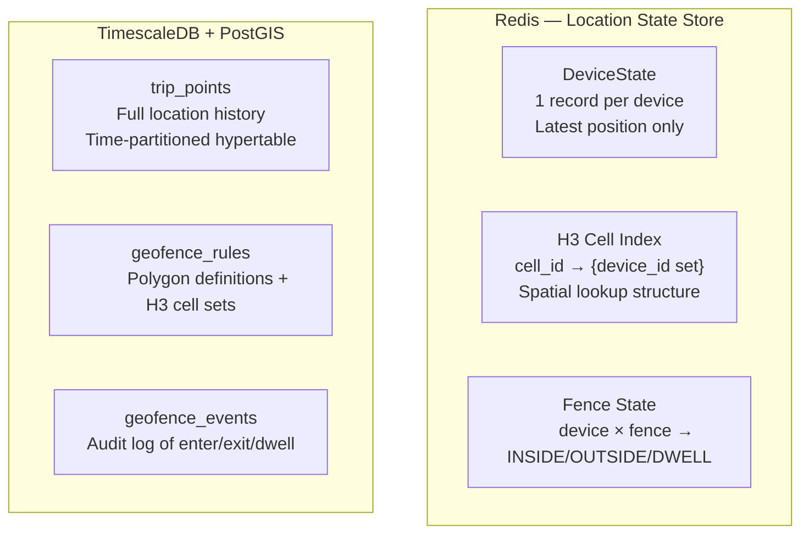
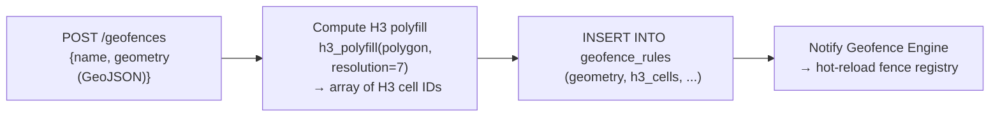

# SignalRoute — Storage Schema

> **Related:** [architecture.md](../architecture.md) · [storage/spatial.md](./spatial.md)
> **Version:** 0.1 (Draft)

This document covers the physical data model for all SignalRoute storage systems: the Redis Location State Store and the TimescaleDB + PostGIS Trip History Store.

---

## Table of Contents

1. [Data Model Overview](#data-model-overview)
2. [Redis — Location State Store](#redis--location-state-store)
3. [TimescaleDB + PostGIS — Trip History Store](#timescaledb--postgis--trip-history-store)
4. [PostGIS — Geofence Rules](#postgis--geofence-rules)
5. [PostGIS — Geofence Events (Audit Log)](#postgis--geofence-events-audit-log)
6. [Index Strategy](#index-strategy)
7. [Data Retention & Partitioning](#data-retention--partitioning)
8. [Schema Migrations](#schema-migrations)

---

## Data Model Overview

SignalRoute separates concerns across two storage systems based on access pattern:



| Store | Access Pattern | Latency Target | Data Volume |
|-------|---------------|----------------|-------------|
| Redis DeviceState | Point lookup by `device_id` | < 1 ms | O(N devices) records |
| Redis H3 Index | Set membership by `cell_id` | < 2 ms | O(N devices) total entries |
| Redis FenceState | Point lookup by `(device, fence)` | < 1 ms | O(N devices × M fences) |
| PostGIS trip_points | Range scan by `(device_id, time)` | < 100 ms | Unbounded (time-partitioned) |
| PostGIS geofence_rules | Full scan at startup + point lookup | Startup only | O(M fences) |

---

## Redis — Location State Store

### DeviceState Hash

**Key:** `{prefix}:dev:{device_id}` (type: Hash)

| Field | Type | Description |
|-------|------|-------------|
| `lat` | float64 (string) | WGS-84 latitude |
| `lon` | float64 (string) | WGS-84 longitude |
| `alt` | float32 (string) | Altitude in meters (optional) |
| `accuracy` | float32 (string) | GPS accuracy radius in meters |
| `speed` | float32 (string) | Speed in m/s |
| `heading` | float32 (string) | Heading in degrees (0–360) |
| `h3` | int64 (string) | H3 cell ID at configured resolution |
| `seq` | uint64 (string) | Last accepted sequence number |
| `updated_at` | int64 (string) | Unix epoch milliseconds (server time of write) |

**TTL:** `device_ttl_s` (default 3600 s = 1 hour). Reset on every accepted write.

**Read:** `HGETALL {prefix}:dev:{device_id}` — O(1)

**Write (Lua CAS):**
```lua
local key = KEYS[1]
local new_seq = tonumber(ARGV[1])
local current_seq = redis.call('HGET', key, 'seq')
if current_seq == false or new_seq > tonumber(current_seq) then
    redis.call('HMSET', key,
        'lat',      ARGV[2],
        'lon',      ARGV[3],
        'alt',      ARGV[4],
        'accuracy', ARGV[5],
        'speed',    ARGV[6],
        'heading',  ARGV[7],
        'h3',       ARGV[8],
        'seq',      ARGV[1],
        'updated_at', ARGV[9])
    redis.call('EXPIRE', key, ARGV[10])
    return 1  -- accepted
end
return 0  -- rejected (stale seq)
```

### H3 Cell Index

**Key:** `{prefix}:h3:{cell_id}` (type: Set)

Each set contains all `device_id` strings currently located in that H3 cell.

| Operation | Command | When |
|-----------|---------|------|
| Device moves to new cell | `SADD {prefix}:h3:{new_cell} {device_id}` | After successful state update |
| Device leaves old cell | `SREM {prefix}:h3:{old_cell} {device_id}` | After successful state update |
| Nearby query | `SMEMBERS {prefix}:h3:{cell}` | Per cell in k-ring |
| Device expires (TTL cleanup) | `SREM {prefix}:h3:{device_h3} {device_id}` | Background Cleanup Worker |

**Memory estimate:** At 1M devices, assuming average set size of ~50 devices per cell, and ~20,000 active cells: 1M string entries × ~32 bytes average = **~32 MB total for H3 index**.

### Fence State

**Key:** `{prefix}:fence:{device_id}:{fence_id}` (type: Hash)

| Field | Type | Description |
|-------|------|-------------|
| `state` | string | `OUTSIDE` \| `INSIDE` \| `DWELL` |
| `entered_at` | int64 (string) | Unix epoch ms when device entered fence |
| `exited_at` | int64 (string) | Unix epoch ms when device last exited |

**TTL:** Same as DeviceState TTL (linked by cleanup worker).

---

## TimescaleDB + PostGIS — Trip History Store

### `trip_points` Hypertable

```sql
CREATE TABLE trip_points (
    -- Identity
    device_id       TEXT        NOT NULL,
    seq             BIGINT      NOT NULL,

    -- Timing (use event_time for time-series queries)
    event_time      TIMESTAMPTZ NOT NULL,   -- device clock (authoritative for ordering)
    recv_time       TIMESTAMPTZ NOT NULL,   -- gateway receive time (server clock)

    -- Position (PostGIS geography for correct spherical distance)
    location        GEOGRAPHY(Point, 4326) NOT NULL,
    altitude_m      REAL,
    accuracy_m      REAL,

    -- Motion
    speed_ms        REAL,   -- meters per second
    heading_deg     REAL,   -- 0–360, 0 = North

    -- Spatial index field
    h3_r7           BIGINT,                 -- H3 cell at resolution 7

    -- Metadata
    metadata        JSONB DEFAULT '{}',

    -- Constraints
    PRIMARY KEY (device_id, seq)            -- idempotent inserts via ON CONFLICT DO NOTHING
);

-- Convert to TimescaleDB hypertable, daily chunks
SELECT create_hypertable(
    'trip_points',
    'event_time',
    chunk_time_interval => INTERVAL '1 day',
    if_not_exists => TRUE
);

-- Enable columnar compression on chunks older than 7 days (Phase 3)
ALTER TABLE trip_points
    SET (timescaledb.compress,
         timescaledb.compress_orderby = 'event_time',
         timescaledb.compress_segmentby = 'device_id');
```

### Indexes on `trip_points`

```sql
-- Primary access pattern: device timeline queries
CREATE INDEX idx_trip_device_time
    ON trip_points (device_id, event_time DESC);

-- Spatial queries: devices in a geographic area
CREATE INDEX idx_trip_location
    ON trip_points USING GIST (location);

-- H3 cell queries: "all points in cell X during time range Y"
CREATE INDEX idx_trip_h3
    ON trip_points (h3_r7, event_time DESC);

-- Late-arriving event lookup (by receive time)
CREATE INDEX idx_trip_recv_time
    ON trip_points (recv_time DESC);
```

### Query Patterns

**Trip replay (all points for a device in a time range):**
```sql
SELECT device_id, event_time, ST_X(location::geometry) AS lon,
       ST_Y(location::geometry) AS lat, speed_ms, heading_deg
FROM trip_points
WHERE device_id = $1
  AND event_time BETWEEN $2 AND $3
ORDER BY event_time ASC;
-- Uses: idx_trip_device_time (hypertable chunk pruning + index range scan)
```

**Downsampled trip (one point per N seconds):**
```sql
SELECT DISTINCT ON (
    device_id,
    date_trunc('second', event_time) / $sample_interval_s * $sample_interval_s
) device_id, event_time, location, speed_ms
FROM trip_points
WHERE device_id = $1 AND event_time BETWEEN $2 AND $3
ORDER BY device_id, (date_trunc('second', event_time) / $sample_interval_s), event_time;
```

**Spatial range (all devices that passed through a circle):**
```sql
SELECT DISTINCT device_id
FROM trip_points
WHERE event_time BETWEEN $1 AND $2
  AND ST_DWithin(location, ST_Point($lon, $lat)::geography, $radius_m);
-- Uses: idx_trip_location (GIST) + hypertable time pruning
```

**Distance traveled (a device, over a time period):**
```sql
SELECT
    SUM(ST_Distance(
        LAG(location) OVER (PARTITION BY device_id ORDER BY event_time),
        location
    )) AS total_distance_m
FROM trip_points
WHERE device_id = $1 AND event_time BETWEEN $2 AND $3;
```

---

## PostGIS — Geofence Rules

### `geofence_rules` Table

```sql
CREATE TABLE geofence_rules (
    fence_id            UUID PRIMARY KEY DEFAULT gen_random_uuid(),
    name                TEXT NOT NULL,
    description         TEXT,
    geometry            GEOGRAPHY(Polygon, 4326) NOT NULL,

    -- H3 polyfill — the set of H3 cells (at resolution 7) that cover the polygon
    -- Used for fast pre-filtering: if device's H3 cell not in this array, skip polygon test
    h3_cells            BIGINT[] NOT NULL DEFAULT '{}',

    -- Rules
    active              BOOLEAN NOT NULL DEFAULT TRUE,
    dwell_threshold_s   INT NOT NULL DEFAULT 300,       -- seconds inside before DWELL event
    max_speed_ms        REAL,                            -- NULL = no speed filter

    -- Lifecycle
    created_at          TIMESTAMPTZ NOT NULL DEFAULT NOW(),
    updated_at          TIMESTAMPTZ NOT NULL DEFAULT NOW(),
    expires_at          TIMESTAMPTZ,                    -- NULL = no expiry
    metadata            JSONB DEFAULT '{}',

    -- Constraints
    CONSTRAINT name_unique UNIQUE (name)
);

-- Spatial index on fence geometry (for PostGIS containment queries)
CREATE INDEX idx_geofence_geometry
    ON geofence_rules USING GIST (geometry);

-- GIN index on H3 cell array (for containment checks: ANY(h3_cells) = device_h3)
CREATE INDEX idx_geofence_h3_cells
    ON geofence_rules USING GIN (h3_cells);
```

### H3 Polyfill Generation

When a new geofence is created via the Admin API:



The polyfill is computed once at creation and stored as `BIGINT[]`. For the Geofence Engine's in-memory registry, the polyfill is loaded at startup and converted into a hash set for O(1) cell membership checks.

---

## PostGIS — Geofence Events (Audit Log)

### `geofence_events` Table

```sql
CREATE TABLE geofence_events (
    event_id        UUID PRIMARY KEY DEFAULT gen_random_uuid(),
    device_id       TEXT NOT NULL,
    fence_id        UUID NOT NULL REFERENCES geofence_rules(fence_id),
    fence_name      TEXT NOT NULL,
    event_type      TEXT NOT NULL CHECK (event_type IN ('ENTER', 'EXIT', 'DWELL')),
    event_time      TIMESTAMPTZ NOT NULL,   -- when the transition was detected
    location        GEOGRAPHY(Point, 4326), -- device position at event time
    inside_duration_s INT,                  -- for DWELL events: time inside fence
    created_at      TIMESTAMPTZ NOT NULL DEFAULT NOW()
);

-- Hypertable for time-series access
SELECT create_hypertable('geofence_events', 'event_time',
    chunk_time_interval => INTERVAL '1 day');

-- Access patterns
CREATE INDEX idx_gfe_device_time
    ON geofence_events (device_id, event_time DESC);

CREATE INDEX idx_gfe_fence_time
    ON geofence_events (fence_id, event_time DESC);
```

**Write:** Geofence Engine appends a row to this table for each ENTER/EXIT/DWELL event (in addition to publishing to Kafka). This table serves as the canonical audit log for compliance use cases.

**Query patterns:**

```sql
-- All events for a device in a time range
SELECT * FROM geofence_events
WHERE device_id = $1 AND event_time BETWEEN $2 AND $3
ORDER BY event_time DESC;

-- All devices that entered a specific fence today
SELECT device_id, event_time, location
FROM geofence_events
WHERE fence_id = $1 AND event_type = 'ENTER'
  AND event_time > NOW() - INTERVAL '1 day';
```

---

## Index Strategy

Summary of all indexes across both storage systems:

### Redis Indexes

| Index | Type | Purpose |
|-------|------|---------|
| `dev:{device_id}` | Hash | Latest state point lookup |
| `h3:{cell_id}` | Set | Nearby search — devices per cell |
| `fence:{device_id}:{fence_id}` | Hash | Per-device geofence state |

### PostGIS Indexes

| Table | Index | Type | Purpose |
|-------|-------|------|---------|
| `trip_points` | `(device_id, event_time DESC)` | B-tree | Trip replay, last-N queries |
| `trip_points` | `location` | GiST | Spatial range queries |
| `trip_points` | `(h3_r7, event_time DESC)` | B-tree | H3 cell time-series |
| `trip_points` | `recv_time DESC` | B-tree | Late event monitoring |
| `geofence_rules` | `geometry` | GiST | Containment query |
| `geofence_rules` | `h3_cells` | GIN | H3 array membership |
| `geofence_events` | `(device_id, event_time DESC)` | B-tree | Device event history |
| `geofence_events` | `(fence_id, event_time DESC)` | B-tree | Fence event history |

---

## Data Retention & Partitioning

### TimescaleDB Chunk Schedule

| Table | Chunk interval | Compression after | Drop after |
|-------|---------------|-------------------|------------|
| `trip_points` | 1 day | 7 days | Configurable (default: never) |
| `geofence_events` | 1 day | 30 days | 90 days (default) |

### Retention Policies

```sql
-- Automatically compress chunks older than 7 days
SELECT add_compression_policy('trip_points',
    INTERVAL '7 days');

-- Drop geofence_events older than 90 days
SELECT add_retention_policy('geofence_events',
    INTERVAL '90 days');
```

Compressed chunks use TimescaleDB's columnar format internally — range scans on `event_time` and `device_id` remain efficient via chunk exclusion + segment decompression.

### Hot vs. Cold Data

| Age | Storage | State |
|-----|---------|-------|
| < 7 days | PostGIS (uncompressed) | Hot — full index access |
| 7–90 days | PostGIS (compressed) | Warm — decompressed on scan |
| > 90 days | S3 / Parquet export (Phase 4) | Cold — batch analytics only |

---

## Schema Migrations

All schema changes are managed via numbered migration SQL files in `db/migrations/`.

| Migration | File | Change |
|-----------|------|--------|
| 001 | `001_initial.sql` | Create `trip_points`, `geofence_rules`, `geofence_events` |
| 002 | `002_h3_column.sql` | Add `h3_r7` column to `trip_points`, add index |
| 003 | `003_compression_policy.sql` | Enable TimescaleDB compression policies |
| 004 | `004_geofence_expiry.sql` | Add `expires_at` to `geofence_rules`, add cleanup job |

Migrations are applied at service startup if `db.auto_migrate = true` (development only). In production, migrations are applied manually or via CI pipeline.
