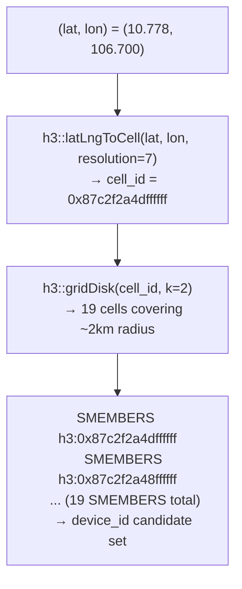
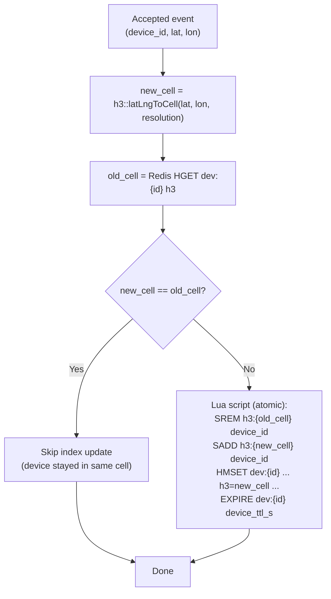
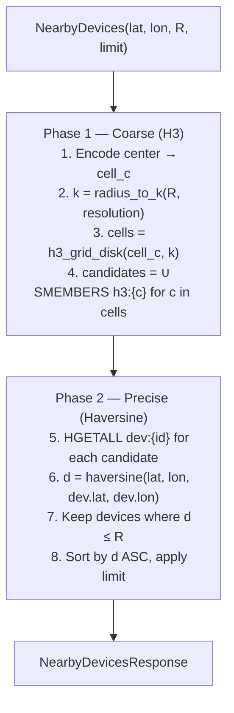
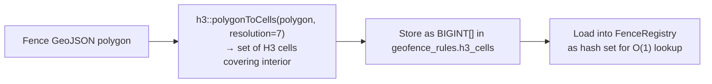
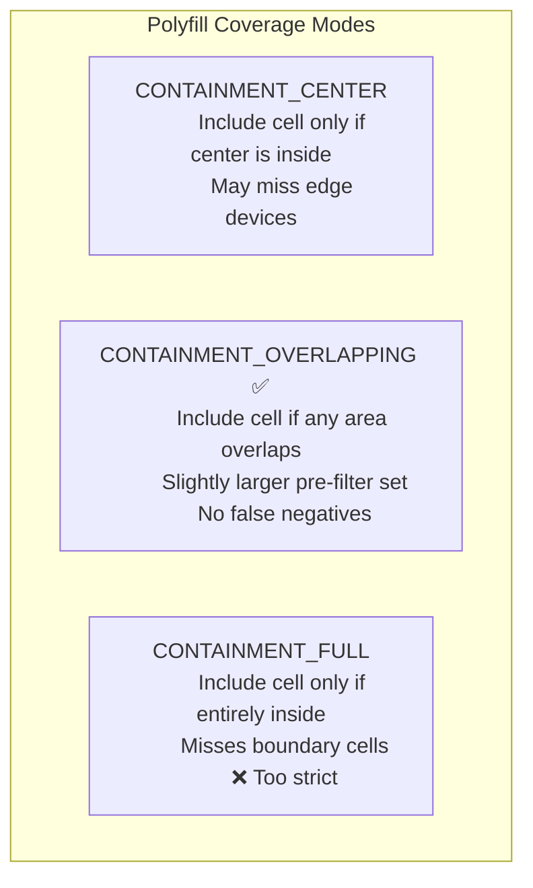
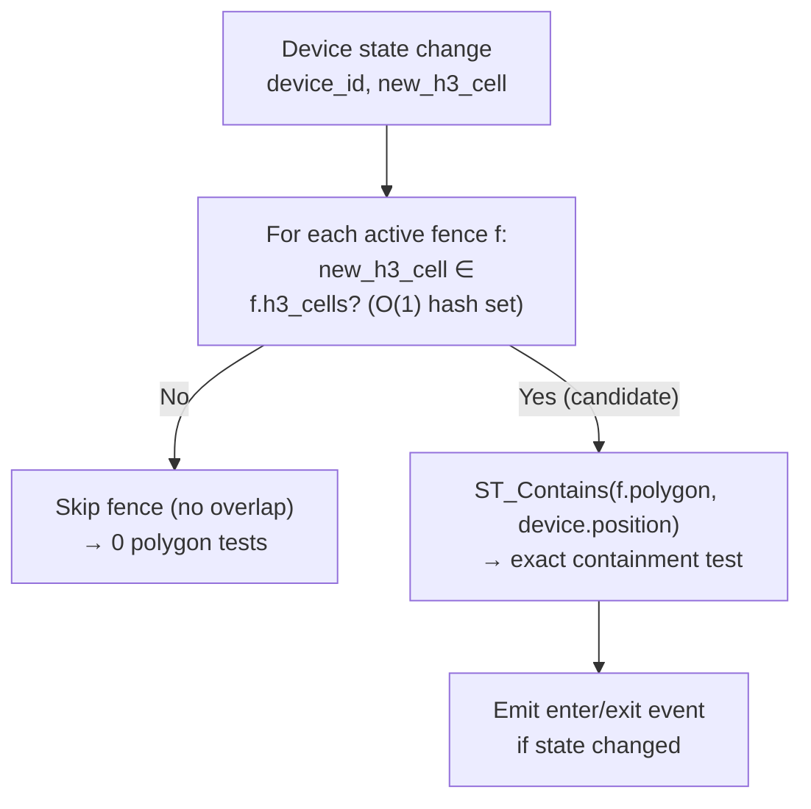
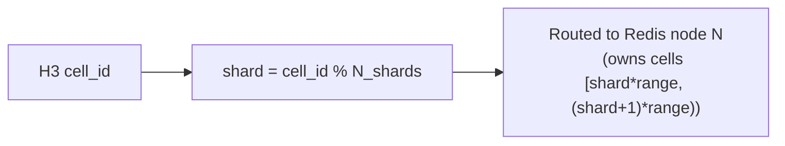

# SignalRoute — Spatial Indexing with H3

> **Related:** [architecture.md](../architecture.md) · [query/spatial_ops.md](../query/spatial_ops.md)
> **Version:** 0.1 (Draft)

This document covers SignalRoute's spatial indexing strategy: how H3 cells are used, resolution selection trade-offs, the k-ring expansion algorithm for nearby search, H3-based geofence pre-filtering, and sharding considerations.

---

## Table of Contents

1. [Why H3](#why-h3)
2. [H3 Fundamentals](#h3-fundamentals)
3. [Resolution Selection](#resolution-selection)
4. [H3 Write Path](#h3-write-path)
5. [k-ring Expansion for Nearby Search](#k-ring-expansion-for-nearby-search)
6. [H3 Geofence Polyfill](#h3-geofence-polyfill)
7. [Sharding by H3 Cell (Future)](#sharding-by-h3-cell-future)
8. [Memory & Performance Characteristics](#memory--performance-characteristics)
9. [Trade-offs vs. Alternatives](#trade-offs-vs-alternatives)

---

## Why H3

SignalRoute requires a spatial index that:

1. **Fits in memory** — the full device-to-cell mapping must live in Redis for sub-millisecond nearby queries
2. **Supports uniform radius expansion** — nearby search must cover a consistent radius regardless of geographic location
3. **Is sharding-friendly** — cells are integers, easy to range-partition across nodes
4. **Has low write overhead** — every accepted location event updates the index; it must be cheap

H3 satisfies all four requirements. The decision matrix:

| Property | H3 | R-tree | Geohash | Quadtree |
|----------|----|--------|---------|---------|
| Fixed integer cell IDs | ✅ | ❌ | Partial (string prefix) | Partial |
| Uniform area per cell | ✅ (hexagons) | N/A | ❌ (rectangular distortion at poles) | ❌ |
| Uniform neighbor distance | ✅ (all 6 neighbors equidistant) | N/A | ❌ | ❌ |
| Fits in Redis as integer keys | ✅ | ❌ | ✅ (as string) | ❌ |
| O(k²) k-ring expansion | ✅ | N/A | Requires edge-case logic | Requires tree traversal |
| Multi-resolution hierarchy | ✅ | N/A | Partial | ✅ |
| Mature C/C++ library | ✅ (`h3-cxx`) | ✅ | ✅ | Varies |

---

## H3 Fundamentals

H3 divides the Earth into a hierarchical grid of hexagonal cells. Key properties:

- Cells at the same resolution have approximately the same area
- Each cell has exactly 6 neighbors (except 12 special pentagon cells near icosahedron vertices — ignored in practice)
- A cell's ID encodes its resolution and position as a 64-bit integer
- Cells at resolution R can be "compacted" — a set of 7 cells at resolution R maps to 1 cell at resolution R-1
- The `k_ring(cell, k)` function returns all cells within k steps of the center — a hexagonal disk



---

## Resolution Selection

### Resolution Comparison Table

| Resolution | Avg Cell Area | Avg Edge Length | k=1 ring area | k=2 ring area | k=3 ring area |
|------------|--------------|-----------------|---------------|---------------|---------------|
| 5 | 252.9 km² | 8.5 km | ~2,277 km² | ~6,574 km² | ~12,898 km² |
| 6 | 36.1 km² | 3.2 km | ~325 km² | ~938 km² | ~1,841 km² |
| **7** | **5.2 km²** | **1.4 km** | **~47 km²** | **~135 km²** | **~265 km²** |
| 8 | 0.7 km² | 0.5 km | ~6.5 km² | ~19 km² | ~37 km² |
| 9 | 0.1 km² | 0.2 km | ~0.9 km² | ~2.7 km² | ~5.3 km² |

### Resolution 7 as Default

Resolution 7 (avg area ~5.2 km²) is the default because:
- **Fleet tracking use case:** vehicles are spread across city or regional areas — a 1–10 km nearby search covers 1–10 cells at k=1..3, producing manageable candidate sets
- **Index size:** 1M devices at resolution 7 occupy ~100–200k distinct active cells; the H3 index in Redis fits in < 100 MB
- **Geofence polyfill:** typical geofences (city blocks to neighborhoods) require 5–50 cells to cover at resolution 7 — a manageable polyfill size

### When to Use Other Resolutions

| Use Case | Resolution | Rationale |
|----------|------------|-----------|
| National fleet tracking | 6 | Fewer cells, broader radius per k step |
| Urban last-mile delivery | 8 | ~500m granularity, denser cell fill |
| Warehouse asset tracking | 9 | ~200m granularity |
| Mixed fleet (configurable) | 7 (default) + 9 (precision mode) | Store two H3 fields; query selects resolution |

---

## H3 Write Path

Every accepted location event updates the H3 cell index atomically with the device state.

### Update Algorithm



The entire state update + cell index adjustment runs in a single Lua script to prevent races where a device could be in both the old and new cell simultaneously.

### Index Update Frequency

At high GPS update rates (e.g., 1 Hz per device), most updates occur within the same H3 cell — especially at resolution 7 where cells are ~5 km². The `same_cell` short-circuit eliminates the `SREM`/`SADD` cost for stationary or slow-moving devices.

Estimate for vehicle moving at 60 km/h at resolution 7:
- Cell traversal time ≈ `edge_length / speed` ≈ `1400 m / (60/3.6 m/s)` ≈ **84 seconds**
- Index write overhead affects < 2% of events at this speed

---

## k-ring Expansion for Nearby Search

The nearby query converts a radius in meters to a k-ring size, then fetches all devices from the candidate cells.

### Radius-to-k Mapping

```
k = ceil(radius_m / h3_avg_edge_length_m(resolution))
```

For resolution 7 (avg edge length ≈ 1,406 m):

| Search Radius | k | Cells in ring | Expected device candidates (at 1M devices) |
|--------------|---|---------------|-------------------------------------------|
| 500 m | 1 | 7 | ~45 |
| 1 km | 1 | 7 | ~45 |
| 2 km | 2 | 19 | ~120 |
| 5 km | 4 | 61 | ~390 |
| 10 km | 8 | 217 | ~1,390 |
| 20 km | 15 | 721 | ~4,600 |

### Two-Phase Query



### Over-fetch Factor

H3 cells are hexagons inscribed within the search circle. The k-ring is always slightly larger than the exact circle. Over-fetch factor (ratio of ring area to circle area) is approximately:

| k | Over-fetch |
|---|-----------|
| 1 | ~2.1× |
| 2 | ~2.3× |
| 4 | ~2.5× |
| 8 | ~2.8× |

The haversine filter in Phase 2 removes the over-fetched candidates. For a 10 km search with ~1,390 candidates, the haversine filter processes ~560 false positives — negligible CPU cost.

### Pipeline Optimization (Batch HGETALL)

Instead of issuing HGETALL one device at a time, the Query Service pipelines all requests:

```
PIPELINE
  HGETALL dev:{id_1}
  HGETALL dev:{id_2}
  ...
  HGETALL dev:{id_N}
EXECUTE
```

This reduces round-trips from N to 1 (or a small number of pipeline batches).

---

## H3 Geofence Polyfill

When a geofence polygon is registered, SignalRoute computes the H3 **polyfill** — the set of H3 cells that fully cover the polygon interior.

### Polyfill Computation



### Polyfill Coverage

H3 polyfill uses the `containmentMode = CONTAINMENT_OVERLAPPING` mode, which includes cells whose area overlaps the polygon even if the cell center is outside. This ensures no device inside the fence is missed due to cell edge effects.



**Chosen mode:** `CONTAINMENT_OVERLAPPING` — the polygon containment test in Phase 2 eliminates any over-selected cells precisely.

### Polyfill Size Examples

| Fence Type | Approximate Area | H3 cells (resolution 7) | Exact test needed? |
|------------|-----------------|------------------------|--------------------|
| City block | 0.01 km² | 1–3 | Almost never (polygon test cheap) |
| Neighborhood | 1 km² | 1–5 | Rarely |
| Airport | 10 km² | 10–20 | Yes (boundary precision) |
| City district | 50 km² | 50–100 | Yes |
| Urban zone | 200 km² | ~200 | Yes |

### Geofence Evaluation using Polyfill



With 1,000 fences and resolution 7 cells, the average device-update evaluation touches 2–5 candidate fences (based on typical geographic fence density), performing 2–5 polygon tests per event.

---

## Sharding by H3 Cell (Future)

In Phase 2+, the H3 index can be used to shard both the State Store and Query Service:



H3 cells are compact 64-bit integers — straightforward to range-partition across Redis Cluster slots or across dedicated nodes. Geographically close devices will be in close-numbered cells at the same resolution, improving cache locality per shard.

**Consideration:** Nearby queries that span multiple cells will require fan-out to multiple shards. With k=2 (19 cells), a query might touch 2–4 shards. This is acceptable and analogous to how distributed databases handle range queries.

---

## Memory & Performance Characteristics

### H3 Index Memory (Redis)

| Metric | Value | Notes |
|--------|-------|-------|
| H3 cell key overhead | ~40 bytes per key | `h3:{15-char-hex}` + Redis hash overhead |
| Per-device entry in Set | ~24 bytes | device_id string length varies |
| At 1M devices, resolution 7 | ~64 MB | ~200k distinct cells, avg 5 devices/cell |
| At 10M devices, resolution 7 | ~640 MB | Consider Redis Cluster or resolution 6 |

### k-ring Computation Cost (CPU)

| k | Cells | h3_grid_disk time (C++) |
|---|-------|------------------------|
| 1 | 7 | < 1 μs |
| 4 | 61 | ~5 μs |
| 8 | 217 | ~15 μs |
| 15 | 721 | ~50 μs |

k-ring computation is entirely CPU-local (no I/O). It is not a bottleneck at any realistic query rate.

---

## Trade-offs vs. Alternatives

| Approach | Pros | Cons | Verdict |
|----------|------|------|---------|
| **H3 (chosen)** | Integer cell IDs; uniform hexagons; k-ring in O(k²); fits in Redis | Slight polar distortion (12 pentagon cells); polyfill not pixel-perfect | ✅ Best fit |
| **PostGIS ST_DWithin only** | Exact geometry; full SQL | Full table scan without timescale pruning; not suitable for real-time nearby | ❌ Too slow for real-time |
| **Geohash** | String prefix similarity | Rectangular distortion; boundary queries require 8-neighbor lookup | ❌ Boundary artifacts |
| **R-tree in-process** | Exact; no Redis dependency | Hard to share across Query Service instances; rebuild on restart | ❌ Not horizontally scalable |
| **S2 cells (Google)** | Square-based; good at poles | Less ecosystem support in C++ community; similar trade-offs to H3 | Viable alternative |
